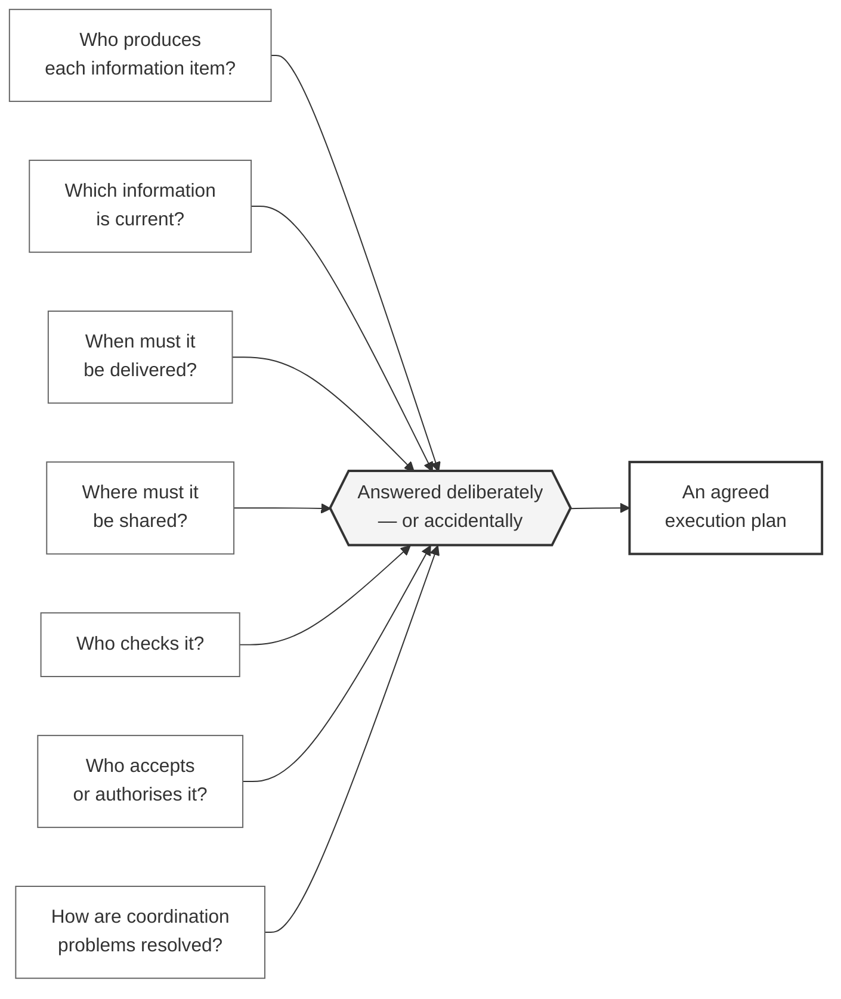

# M01-S02 — The coordination problem

| Field | Value |
|---|---|
| **Visual identifier** | `M01-S02` |
| **Related slide** | Slide 2 — Without an agreed execution plan, coordination becomes accidental |
| **Purpose** | Show seven recurring project uncertainties converging on the need for an agreed execution plan |
| **Source format** | Mermaid `flowchart` |
| **Source documents** | `bep/Harrismith-Fire-Station-BEP.md` §1.1 (controlled, traceable, repeatable; known originator, known state, known route, known accountable role); §5.1; `supporting/coordination-review-strategy.md` §1 |
| **Evidence classification** | **INTERPRETATION** — the seven questions are derived from BEP §1.1's statement of intent. The convergence framing and the teaching statement are **SYNTHESIS** |
| **Known limitation** | **These are generic project uncertainties, not recorded Harrismith failures.** No source records any of these as having occurred on the project. The diagram must never be captioned as Harrismith's problem history |
| **Last increment** | T1-D |

---

## 1. Diagram source

## 2. Reading the diagram

Seven questions arise on every multidisciplinary project. The hub is the point of
the slide: **they get answered either way.** The only variable is whether the
team answers them deliberately and in advance, or whether they are answered
accidentally, part-way through, by whoever is in the room.

The single output node is the agreed execution plan — arrived at as the *answer
to a problem*, not introduced as a document.

## 3. Teaching statement carried on this slide

> Good individual models do not automatically create good project information.

**This is teaching wording, not source wording.** It is consistent with BEP §5.1
("two kinds of responsibility") and Coordination Strategy §1 ("interfaces, not
geometry alone"), but no source sentence says it. Classified **Partial** in
[`source-map.md`](../../../module-01-what-is-a-bep/source-map.md) subject 1.

## 4. Simplification and omission

| Simplify | Omit |
|---|---|
| Seven short questions, one line each where possible | Any Harrismith-specific failure, clash or incident |
| One hub, one outcome | Any discipline name — the questions are universal |
| No dates, no roles | Any implication that Harrismith experienced these problems |

**If seven nodes read as cluttered at presentation scale**, split into two builds
of four and three, or drop Q4 and Q7 to the spoken commentary. Do not shrink the
type to fit all seven.

## 5. Overclaim risk

**Low, with one specific guard.** The diagram describes a general condition of
multidisciplinary projects. It becomes an overclaim the moment it is captioned as
*what went wrong on Harrismith* — nothing in the sources supports that, and the
repository records observations, not failures.
