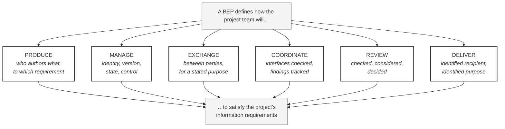

# M01-S03 — The six BEP actions

| Field | Value |
|---|---|
| **Visual identifier** | `M01-S03` |
| **Related slide** | Slide 3 — A BEP is the agreed operating plan for project information |
| **Purpose** | Present the six verbs as the spine of the whole presentation, and bound the definition with what a BEP is not |
| **Source format** | Mermaid `flowchart` + Markdown table |
| **Source documents** | The six verbs correspond to `bep/Harrismith-Fire-Station-BEP.md` §1.1 and the BEP's own section architecture — production and sharing §7, CDE §6, coordination §8, review §9, delivery §10 |
| **Evidence classification** | **SYNTHESIS** — the six-verb framing is a teaching device. The BEP does not enumerate six verbs, and the "is not" list is constructed for teaching |
| **Known limitation** | Must be labelled as teaching framing. Do not attribute "the six verbs" to any Harrismith document |
| **Last increment** | T1-D |

---

## 1. Diagram source

## 2. Where each verb is expanded later in the talk

This mapping is the reason the six verbs are worth teaching as a spine — every
later section is one of them opened up.

| Verb | Expanded on |
|---|---|
| Produce | Slides 7–8 — responsibility matrices and delivery planning |
| Manage | Slides 9–10 — CDE states and governed status |
| Exchange | Slides 8, 10 — delivery events and controlled transitions |
| Coordinate | Slides 11–12 — the coordination cycle and issue lifecycle |
| Review | Slides 4, 12 — review and approval functions; verification |
| Deliver | Slide 8 — information-delivery planning |

## 3. Companion panel — what a BEP is not

Shown as a second build or a facing panel. **Table, not a diagram** — Mermaid
would add structure without adding meaning.

| A BEP is **not** | Why the confusion arises |
|---|---|
| Only a Revit modelling manual | Authoring conventions are part of it, so the part is mistaken for the whole |
| Merely a naming-convention document | Naming is visible and concrete; it stands in for the invisible governance around it |
| A generic company template copied unchanged | A template has not agreed anything with *this* project's team |
| Only the BIM manager's private procedure | If one person knows it, there is no agreement — only a preference |
| **Proof that the agreed process is being implemented** | An agreed process and a running process are different states |

**The last row is the seed of Slide 13.** Plant it here; harvest it there.

## 4. Simplification and omission

| Simplify | Omit |
|---|---|
| Six verbs in capitals; sub-text optional and small | The italic sub-text entirely, if it does not read at scale |
| One entry node, one outcome node | Any numbering that implies sequence — these are not six steps |
| The "is not" list as a separate build | Any product logo or software name in the diagram itself |

**These are not a sequence.** If the layout reads as a pipeline, use a radial or
grid arrangement instead. Nothing in the sources orders them.

## 5. Overclaim risk

**Low as a diagram, moderate as an attribution.** The risk is not visual — it is
saying "the BEP defines six verbs." It does not. This is a teaching compression,
and the presenter should be able to say so if asked where it comes from.
