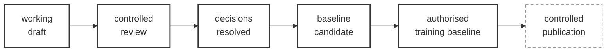

# M01-S04 — BEP governance functions

| Field | Value |
|---|---|
| **Visual identifier** | `M01-S04` |
| **Related slide** | Slide 4 — Who prepares, reviews and approves the BEP? |
| **Purpose** | Show preparation, contribution, review, approval/authorisation and implementation as five distinct functions — and defeat the "one BIM manager owns it" misconception |
| **Source format** | Mermaid `flowchart` |
| **Source documents** | `supporting/information-management-responsibility-matrix.md` §3.1 row G1, §3.7 rows A2–A4, §4; `bep/Harrismith-Fire-Station-BEP.md` §5.2, §5.5, §5.9, §9.10, §12.7 |
| **Evidence classification** | **DIRECT** for G1's Perform/Consult allocation, the BIM Manager's limits, the §9.10 route and "no single universal approver exists"; **INTERPRETATION** for the five-function framing, which no source enumerates |
| **Known limitation** | **Every role holder is TBD.** No appointing party, lead delivery party, BIM manager, coordinator, task-team lead, author, checker or CDE administrator is established. Functions only — never names |
| **Last increment** | T1-D |

---

## 1. Diagram source

```mermaid
flowchart LR
    subgraph CONSULT ["Consulted on the framework — IM matrix G1"]
        direction TB
        AP["Owner /<br/>Appointing Party"]
        LDP["Lead<br/>Delivery Party"]
        BC["BIM<br/>Coordinator"]
        TTL["Task-Team<br/>Leads"]
    end

    CONSULT -.->|"Consult"| PREP

    PREP["1. PREPARE / MAINTAIN<br/>BIM Manager performs"]
    CONTRIB["2. CONTRIBUTE<br/>task teams, via<br/>the Working Process"]
    REVIEW["3. REVIEW<br/>controlled review"]
    APPROVE["4. APPROVE / AUTHORISE<br/>a separate defined function"]
    IMPLEMENT["5. IMPLEMENT<br/>the whole delivery team"]

    PREP --> CONTRIB --> REVIEW --> APPROVE --> IMPLEMENT

    NOTE["No single function owns all five.<br/>All holders TBD."]

    IMPLEMENT -.-> NOTE

    classDef fn fill:#ffffff,stroke:#333,stroke-width:2px;
    classDef role fill:#f7f7f7,stroke:#999,stroke-width:1px;
    classDef note fill:#f4f4f4,stroke:#666,stroke-width:1px,stroke-dasharray: 4 3;
    class PREP,CONTRIB,REVIEW,APPROVE,IMPLEMENT fn;
    class AP,LDP,BC,TTL role;
    class NOTE note;
```

## 2. Companion strip — the route the BEP itself travelled

Source: BEP §9.10, verbatim sequence.

**The dashed final node is required, not stylistic.** Harrismith reached
*authorised training baseline* — approved with conditions — and has **not**
reached controlled publication. Drawing the last box solid would assert a
publication that has not occurred and is not authorised.

## 3. The three sourced statements this diagram must carry

| Statement | Source |
|---|---|
| The BIM Manager is **not** automatically the Appointing Party, Lead Delivery Party, a design approver, a discipline technical lead or a contractual decision-maker | BEP §5.5 |
| **No single universal approver exists**; unlimited authority is not assigned to the BIM Manager | IM matrix §3.7 A2 note; BEP §12.7 |
| **CDE Administration implements governance; it does not create it** | BEP §5.9 |

## 4. Simplification and omission

| Simplify | Omit |
|---|---|
| Five function boxes, numbered, left to right | The full G-row table from the IM matrix |
| One dashed "Consult" input group | The AG-001 to AG-005 governance identifiers — correct but off-topic, and they pull questions toward publication planning |
| One TBD note | Any person, company, signatory or job title |

## 5. Design constraint — do not draw a hierarchy

BEP §5.2 states that its role model is a **conceptual functional model, not an
appointment chart and not an organisation chart.** A top-down tree implies
reporting lines that do not exist and that the source expressly disclaims.

**Use a left-to-right flow of acts.** The consulted roles attach as inputs, not
as subordinates.

## 6. Overclaim risk

**Low for the diagram; moderate for the approval box.** Labelling box 4 with a
specific function name is accurate for Harrismith's training baseline, but the
audience will hear it as "this is who approves BEPs". Keep the box generic on the
slide and let the speaker supply the Harrismith specific — see
[`speaker-notes.md`](../../../module-01-what-is-a-bep/speaker-notes.md) Slide 4.
