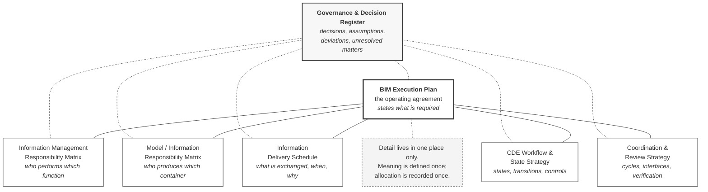
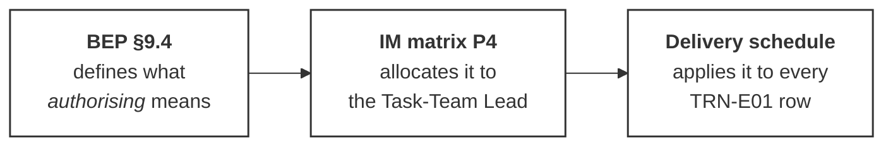

# M01-S06 — The seven-document Harrismith architecture

| Field | Value |
|---|---|
| **Visual identifier** | `M01-S06` |
| **Related slide** | Slide 6 — The Harrismith BEP structure |
| **Purpose** | Show one connected management system — a central agreement with supporting resources around it — and why splitting it that way keeps it maintainable |
| **Source format** | Mermaid `flowchart` |
| **Source documents** | `bep/Harrismith-Fire-Station-BEP.md` §1.4, §13.1, §13.2, §5.12; `supporting/cde-workflow-state-strategy.md` §18; `supporting/information-management-responsibility-matrix.md` §7 |
| **Evidence classification** | **DIRECT** for the seven documents and what each holds; **INTERPRETATION** for the spatial arrangement — the sources state the relationships but propose no diagram |
| **Known limitation** | **No legal or contractual hierarchy is being shown.** The BEP's own authority is recorded as **none** — training / reference, non-contractual. Not every supporting document is complete or operational |
| **Last increment** | T1-D |

---

## 1. Diagram source

## 2. Two required design decisions

**Plain connecting lines, not arrowheads.** The relationship being shown is
*holds the detail for* — not *flows into*, *derives authority from* or
*approves*. Mermaid's `---` and `-.-` are used deliberately in place of `-->`.

**The register sits alongside the whole set, not beneath the BEP.** It records
decisions about every document *including the BEP itself*. Drawing it as a
subordinate misrepresents what it does. Its links are dashed to distinguish
"records decisions about" from "holds detail for".

## 3. The sourced reason for the split

BEP §13.1, quotable verbatim:

> Duplication creates divergence, and divergence in governance documentation is
> worse than absence, because both copies appear authoritative.

BEP §5.12, as a rule of construction:

> Meaning is defined once, allocation is recorded once.

## 4. Worked trace — one rule across three documents

Optional second build. It demonstrates the non-duplication rule rather than
asserting it.

Three documents, three jobs, no duplication. Change the allocation and one file
is edited.

## 5. Simplification and omission

| Simplify | Omit |
|---|---|
| Document titles in plain English | **Full file paths** — `supporting/information-management-responsibility-matrix.md` is unreadable projected |
| A three-to-five word caption per resource | The full purpose sentences from BEP §1.4 and §13.2 |
| One call-out on non-duplication | Any tick, progress bar, completion indicator or maturity score |
| — | Any arrow implying contractual authority or legal precedence |

## 6. Three cautions the slide must carry

1. **No contractual hierarchy is claimed.** BEP §1.5's precedence order concerns
   document conflict, and the BEP's authority is recorded as none.
2. **Reference does not imply approval.** Listing a resource records that the BEP
   depends on it; the resource's own declared status determines reliability
   (BEP §13.1, §13.6).
3. **Not every supporting document is complete or operational.** All seven are
   approved with conditions and **not published**, and each carries its own
   unresolved-matters section.

## 7. Overclaim risk

**Moderate.** A clean seven-node diagram reads as a finished, operating system.
It is a set of controlled documents, five of which explicitly record what they
have not resolved. The caution above is not optional garnish — without it the
diagram asserts completeness the sources deny.
