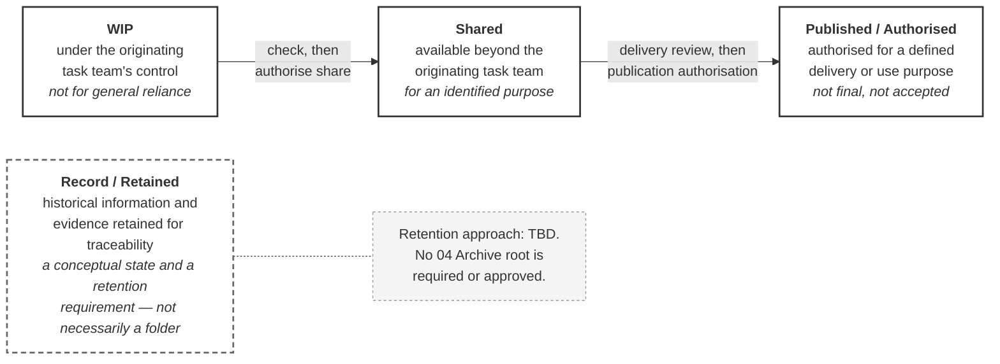

# M01-S09 — CDE states and transitions

| Field | Value |
|---|---|
| **Visual identifier** | `M01-S09` |
| **Related slide** | Slide 9 — Information moves through controlled CDE states |
| **Purpose** | Show four controlled states, each defining permitted use rather than location, with movement by decision rather than drift |
| **Source format** | Mermaid `flowchart` + Markdown term table |
| **Source documents** | `supporting/cde-workflow-state-strategy.md` §1, §2, §3, §13; `bep/Harrismith-Fire-Station-BEP.md` §6.1, §6.3, §6.7, §6.8 |
| **Evidence classification** | **DIRECT** for the four states, their definitions and the five-term separation; **INTERPRETATION** for the required message |
| **Known limitation** | **The fourth state is `Record / Retained`, never `Archived`.** No mandatory CDE root named `04 Archive` is required or approved, none is created, and the retention approach is **TBD**. This strategy does **not** describe the live platform |
| **Last increment** | T1-D |

---

## 1. Diagram source

## 2. Two required design decisions

**`Record / Retained` is drawn detached and dashed.** It is deliberately *not*
placed as a fourth box in the same left-to-right row, because that reads as a
location at the end of a pipeline. The source is explicit that it is a conceptual
state and a retention requirement, **not necessarily a folder**, and that the
retention approach is TBD.

**`Archived` does not appear.** It is not an adopted Harrismith state. If the
audience asks, the answer is in
[`speaker-notes.md`](../../../module-01-what-is-a-bep/speaker-notes.md) Slide 9.

## 3. Companion table — five terms never used interchangeably

Source: CDE Strategy §13; BEP §6.8.

| Term | Meaning |
|---|---|
| **Version** | A platform or file-history instance |
| **Revision** | A controlled issue identifier, where project convention requires one |
| **State** | WIP / Shared / Published / retained |
| **Status** | A workflow or decision condition |
| **Suitability** | The permitted intended use |

> A new version does not automatically mean a new revision, a new state,
> approval, or suitability for a new purpose.

Show as a table beside or beneath the diagram, or hold it entirely in speech if
the slide is crowded.

## 4. Required message

> A CDE state describes how information may be used, not merely where the file
> is stored.

**Supported interpretation.** Both halves are sourced — the CDE is a process not
a folder tree (BEP §6.1), and suitability is the permitted intended use (CDE
Strategy §13) — but not in this single sentence.

## 5. Simplification and omission

| Simplify | Omit |
|---|---|
| Four states, four short definitions | **`Archived` in any form** |
| One "does not mean" line per state | Any folder icon, folder name or file path |
| Two labelled transitions | The full §13 five-term table, if it does not fit |
| — | The eight-step transition control table — that is `M01-S10` |

## 6. Overclaim risk

**Medium.** A clean state diagram implies the model is operating. The CDE
Strategy states plainly that it "does not describe the live platform" and is
**not** evidence that the current Autodesk configuration matches it.

**Caption it as the governed model, not as current project behaviour.**

Note also that the transition drawn from Shared to Published is shown here
without its authority — that authority is **unresolved**, and `M01-S10` carries
that fact. If Slide 10 is cut for time, this diagram must acquire the blocked
marker itself.
