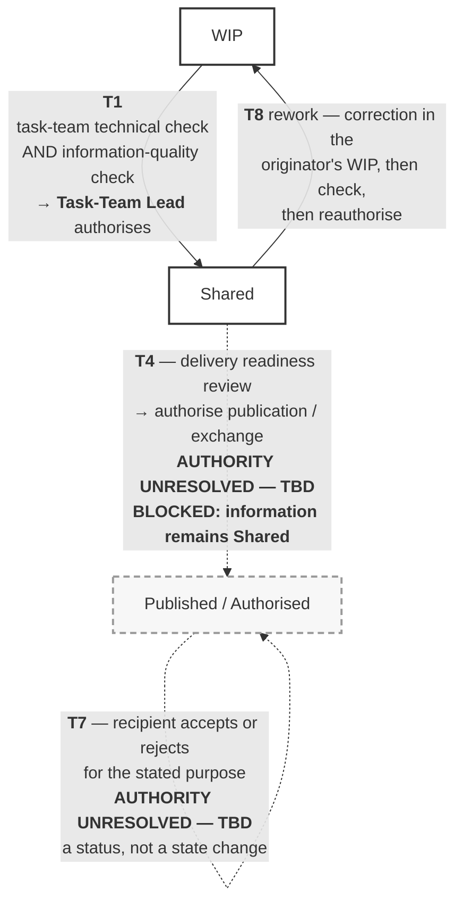
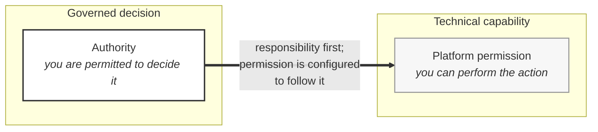

# M01-S10 — Folder location versus governed information status

| Field | Value |
|---|---|
| **Visual identifier** | `M01-S10` |
| **Related slide** | Slide 10 — A folder location is not the same as an information status |
| **Purpose** | Separate technical file movement from governed status transition, and separate permission from authority |
| **Source format** | Mermaid `flowchart` (transitions) + Markdown table (the eight concepts) |
| **Source documents** | `supporting/cde-workflow-state-strategy.md` §3.1, §3.2, §3.3, §13, §14, §17; `bep/Harrismith-Fire-Station-BEP.md` §1.5, §5.9, §6.9, §9.7, §9.8 |
| **Evidence classification** | **DIRECT** for every transition, trigger, function and unresolved authority; **INTERPRETATION** for the eight-concept list; **SYNTHESIS** for the required message |
| **Known limitation** | **Two of the eight transitions have no assigned authority, and T4 is blocked.** The sequence must never be drawn as complete — doing so would manufacture governance the sources refuse to invent |
| **Last increment** | T1-D |

---

## 1. Primary diagram — the controlled transitions

Four of the eight steps. **T4 is drawn blocked; that is a requirement, not a
style choice.**

**Reading it:** T1 is a solid arrow with a named function. T4 is dashed, marked
unresolved and marked blocked. T7 loops back on Published because acceptance is a
**status**, not a state change. T8 returns information to the originator's WIP.

Only **T1** and **T4** are information-state transitions. T2 (consume), T3
(coordination input), T5 (deliver) and T6 (receive) are omitted from the slide —
they change no state, and their omission is explained in §3.

## 2. Companion table — eight things routinely collapsed into one

| Concept | What it actually is |
|---|---|
| **Folder location** | Where the platform stores it |
| **Workflow state** | WIP / Shared / Published / Authorised / Record / Retained |
| **Suitability** | The permitted intended use |
| **Review completion** | That a defined consideration occurred |
| **Authorisation** | Permission to progress, for a defined purpose |
| **Publication / exchange authority** | Who may authorise that progression — **UNRESOLVED** |
| **Recipient acceptance** | A recipient's decision for a stated purpose — a *status*, not a state |
| **Retention / record status** | Held as evidence for traceability |

## 3. Second panel — what is *not* a state

Source: CDE Strategy §3 and §13. Useful as a build if time allows.

| Concept | What it actually is |
|---|---|
| **Consume** | A receiving-team **action** |
| **Coordination input** | An approved **use and context** of Shared information |
| **Deliver** | An exchange **event** |
| **Receive** | A recipient **event** |
| **Accept** | A recipient **decision and status** for a stated purpose |

> An event or a decision does not create a new information state unless the
> governed state-transition rule explicitly says it does.

## 4. Permission versus authority

The second half of the slide. **Draw them as two separate, non-touching
concepts** — no arrow between them, because there is no relationship of
derivation.

**The single arrow runs from authority to permission, never the reverse.** Access
is configured to *follow* approved responsibility — responsibility comes first
and permission follows it. Where the two diverge, the divergence is recorded as a
**deviation**, not treated as a redefinition of who is responsible.

Sourced statements this panel carries:

- Platform access does **not** confer authority to share, publication authority,
  technical approval authority or acceptance authority.
- **CDE Administration implements governance; it does not define it. Changing the
  software does not make a decision.**
- Authority is never inferred upward from platform configuration (BEP §1.5).

## 5. Required message

> Moving a file is a technical action; changing its information status is a
> governed decision.

**Teaching wording.** The nearest source statement is CDE Strategy §14's
"Changing the software does not make a decision."

## 6. Simplification and omission

| Simplify | Omit |
|---|---|
| Four transitions, not eight | All three sub-tables of §3 in full |
| Four columns: from, to, trigger/check, function | T2, T3, T5, T6 from the primary diagram |
| The two **UNRESOLVED — TBD** values enlarged | Any arrow suggesting automation |
| — | **Any Autodesk permission-settings screenshot** |

## 7. Overclaim risk

**Low if T4 is shown blocked. High if the sequence is drawn as complete.**

This is the one visual in the module where a tidier diagram would be a governance
failure. A clean WIP → Shared → Published chain with named functions at every
arrow would invent a publication authority that three separate sources record as
unresolved.

**A later live observation would be actively counterproductive here.** A
permissions view invites precisely the permission-equals-authority inference the
slide exists to refute.
