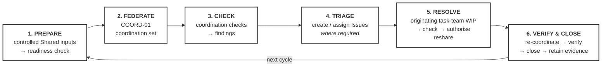
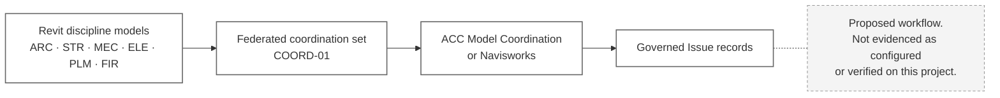

# M01-S11 — The coordination-review cycle

| Field | Value |
|---|---|
| **Visual identifier** | `M01-S11` |
| **Related slide** | Slide 11 — Coordination is a managed review cycle |
| **Purpose** | Show coordination as a repeatable management cycle, not a single clash-detection event |
| **Source format** | Mermaid `flowchart` — circular |
| **Source documents** | `supporting/coordination-review-strategy.md` §1, §6, §7, §8, §12, §17, §21, §26; `supporting/model-information-responsibility-matrix.md` §3.4; `bep/Harrismith-Fire-Station-BEP.md` §8 |
| **Evidence classification** | **DIRECT** for the cycle and the four distinctions; **INTERPRETATION** for the six-stage compression of the source's sixteen steps |
| **Known limitation** | **Not evidenced as running.** No Design Collaboration Coordination Space was observed configured (`OF-005`); the issue status model is **not claimed to be configured**; the taxonomy-to-platform mapping is **not yet made**. Tolerances **TBD**; cycle frequency **not established** |
| **Last increment** | T1-D |

---

## 1. Diagram source

The source's sixteen steps compressed to six stages, as used by Slides 11–12.

**The return arrow matters.** It is what makes this a cycle rather than a
procedure, and it is the difference between coordination as a management activity
and coordination as a one-off test.

## 2. The four distinctions the slide must carry

All four are direct source wording.

| Distinction | Statement |
|---|---|
| **Interfaces, not geometry alone** | Coordination manages multidisciplinary interfaces; **clash detection is one technique**, not the whole process |
| **Federation does not merge ownership** | COORD-01 does not merge authorship, transfer technical ownership, create a new design author, replace the discipline containers, or automatically become a deliverable |
| **A finding is not an Issue** | Creating an Issue is a decision taken at triage, not an automatic consequence of detection |
| **Completion is not "zero clashes."** | A zero-clash report can be produced by testing nothing, excluding everything, or resolving symptoms rather than interfaces |

## 3. Optional panel — the conceptual tool connection

**For a future visual only. Present as *how this would work*, never as *how this
is running*.**

**The warning node is mandatory if this panel is used.** Three sourced facts
require it: no Coordination Space was observed configured; the status model is
not claimed to be configured; the platform mapping is not yet made.

Also sourced and worth one spoken sentence: **Navisworks is not a separate
governance system.** A result found there enters the same governed finding and
Issue workflow — the tool used to find something does not determine how it is
managed.

## 4. Simplification and omission

| Simplify | Omit |
|---|---|
| Six stages, one line of detail each | The full sixteen-step list |
| One return arrow | **Any Navisworks or Model Coordination screenshot** |
| The four distinctions as spoken points or a facing panel | Any clash count |
| — | Any tolerance value — **TBD** in source |
| — | Any meeting or cycle frequency — **not established** |

## 5. Caption requirement

If a federated-model image is ever used alongside this diagram, it is captioned
as *the governed coordination model* — **never** as *Harrismith's coordination
process in operation*.

## 6. Overclaim risk

**High — the second highest in the module, after `M01-S12`.**

A clean cycle diagram reads as a process that runs. The sources record the
opposite: presence of an area is not evidence that a governed coordination
process is operating, and the live project was not accessed. Any platform imagery
compounds the problem rather than illustrating it.
