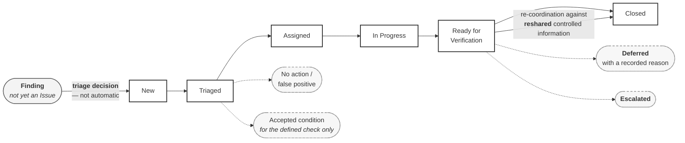

# M01-S12 — Issue lifecycle

| Field | Value |
|---|---|
| **Visual identifier** | `M01-S12` |
| **Related slide** | Slide 12 — From coordination issue to recorded resolution |
| **Purpose** | Show that detecting and recording an issue is not resolving and closing it — and that closure approves nothing |
| **Source format** | Mermaid `flowchart` |
| **Source documents** | `supporting/coordination-review-strategy.md` §12, §13, §15, §16, §18, §19, §22, §27 |
| **Evidence classification** | **DIRECT** for the status model, triage decision, assignment rule, closure rule and verification limits; **INTERPRETATION** for the five-function table |
| **Known limitation** | **This is the governance status model. It is expressly not claimed to be configured in Forma.** Platform implementation may use different native labels, and configuring it would follow a governance decision that has not been taken |
| **Last increment** | T1-D |

---

## 1. Diagram source

**Three deliberate features:**

1. **The finding sits outside the status chain.** It enters only through a triage
   decision. Drawing it as status zero would assert the automatic promotion the
   source denies.
2. **Deferred and Escalated branch off, they do not terminate the chain.** They
   are controlled alternate dispositions, not failure states.
3. **The arrow into `Closed` is labelled with its condition.** Closure follows
   re-coordination against reshared information — never someone's word.

## 2. Companion table — five functions that are not the same

| Function | Holds | Does not hold |
|---|---|---|
| **Issue owner / coordinator** | Coordination of assignment and the process | Responsibility for designing the fix |
| **Model author / task team** | The technical response, in its own WIP | Authority to self-authorise the reshare |
| **Reviewer** | Consideration for a stated purpose | Approval |
| **Verifier (BIM Coordinator)** | Confirmation that the process reached a disposition | Design approval, certification, publication authority, recipient acceptance |
| **Acceptance function** | A recipient decision for a stated purpose | — **UNRESOLVED / recipient-dependent** |

**No single universal approver exists.** The sources do not establish one, and
this visual does not invent one.

## 3. The four statements this visual must carry

| # | Statement | Status |
|---|---|---|
| 1 | A finding is not automatically an Issue — creating one is a triage decision | **DIRECT** |
| 2 | *"An Issue assigned to a task team does not make the BIM Coordinator responsible for designing the fix"* | **DIRECT — quotable** |
| 3 | *"A material Issue is not closed solely because someone says it was fixed in WIP"* — a change nobody can see in Shared information has not been demonstrated | **DIRECT — quotable** |
| 4 | Verification is **not** design approval, professional certification, publication authority or recipient acceptance | **DIRECT** |

Also worth one line: *"accepted condition"* at triage means only that the finding
requires no further action **for the defined check and purpose**. It is a
coordination disposition — not recipient acceptance and not design approval.

## 4. Optional worked example — the source's own illustration

The Coordination Strategy §27 carries an **educational workflow example only**,
which it states expressly "does not describe an actual condition on the project."
Safe to use *because* it was constructed under that label.

> A mechanical service route conflicts with structural information — **STR-01**
> versus **MEC-01**.

If shown, carry the source's own limits verbatim: **no actual project geometry,
no clash coordinates, no Issue identifier, no tolerance value, no named person.**

The detail that teaches most: *if only MEC-01 changes, TRN-E02-MEC activates and
TRN-E02-STR does not.*

## 5. Simplification and omission

| Simplify | Omit |
|---|---|
| Six statuses plus two branches | The seven-type issue taxonomy |
| Two triage branches shown, more stated | The seven triage outcomes in full |
| One call-out on the verification condition | **Any ACC Issues screenshot** |
| — | Any issue identifier, clash coordinate, tolerance or named person |

## 6. Do not make this look like a platform

**Plain boxes, governance labels, no product chrome.** No status pills, no avatar
circles, no priority badges, no ACC colour palette.

**If the diagram could be mistaken for a screenshot, redraw it.**

## 7. Overclaim risk

**High — the highest of any single visual in the module.**

A lifecycle diagram styled to resemble an ACC Issues board would assert a
verified live workflow that does not exist. The source states plainly that this
status model **is not claimed to be configured in Forma**, and that the issue
taxonomy and status platform mapping remain **not yet implemented**.

A later live observation is **not** appropriate for this visual: an ACC Issues
view would directly contradict the source's own statement.
