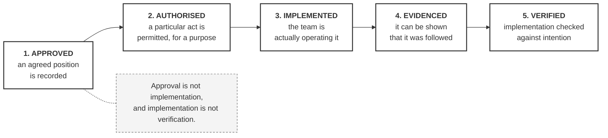
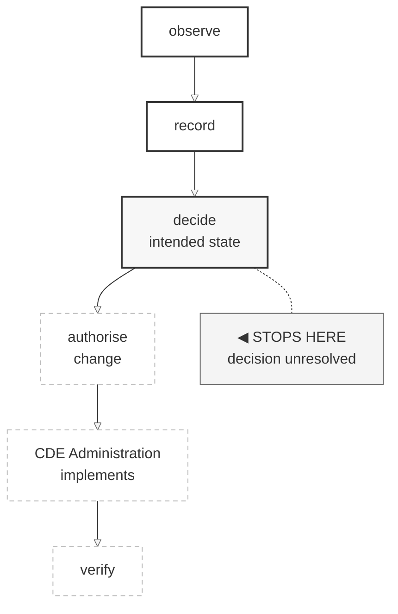

# M01-S13 — Approval versus implementation

| Field | Value |
|---|---|
| **Visual identifier** | `M01-S13` |
| **Related slide** | Slide 13 — Approval does not prove implementation |
| **Purpose** | Separate approved, authorised, implemented, evidenced and verified — and show that a signed BEP is not self-executing |
| **Source format** | Markdown two-column comparison + Mermaid lifecycle strip |
| **Source documents** | `docs/Training-Baseline-0.1-Approval-Decision.md` §3, §8, §11; `bep/Harrismith-Fire-Station-BEP.md` §12.3, §12.8, §12.9, §9.11; `supporting/cde-workflow-state-strategy.md` §6, §16; `supporting/coordination-review-strategy.md` §22 |
| **Evidence classification** | **DIRECT** for the central quotation and the outstanding-implementation statements; **INTERPRETATION** for the five-state framing and the two-column contrast; **SYNTHESIS** for the required message |
| **Known limitation** | **Minimum evidence only.** The publication-planning history — conditions C1–C6, prerequisites P1–P8, PAD-001, the publication hold, the naming control — is **out of scope** and must not appear. Publication automation remains paused and is not reopened |
| **Last increment** | T1-D |

---

## 1. Primary visual — the five states

The quotation is **direct source wording** from the Training Baseline 0.1
Approval Decision §11, which cites BEP §12.3 and §12.9. Quotable verbatim.

## 2. Secondary visual — where UD-001 actually stops

The clearest single illustration available. Source: CDE Strategy §6.

**Observe ✓ and record ✓ are solid. Everything from `authorise change` onward is
dashed and unreached.** Drawing them solid would assert an implementation that
has not occurred.

The sourced reason, worth one spoken line: implementing now would be
*"configuration without a decision behind it — the exact failure this model
exists to prevent."*

And the principle beneath it:

> Observed state does not prove correctness. Intended state does not prove
> implementation. Implementation does not prove success until verified.

## 3. Required contrast — the two columns

| Evidence of **approval** | Evidence of **implementation** |
|---|---|
| A recorded approval decision | Authorised state transitions, with their records |
| Recorded conditions | Completed checking and review records |
| A status designation | Coordination input, finding and Issue records |
| An identified approving function | Verification records |
| A baseline identity | Transmission, receipt and acceptance records |
| — | Retained audit evidence |

The right column is drawn from the sources' own evidence lists — CDE Strategy
§16, Coordination Strategy §22 and BEP §9.11.

**One row is a generic teaching example, not Harrismith evidence:** *correctly
named information*. It would belong on a real project, but **no naming standard
is established** on Harrismith. Include it only if labelled.

## 4. Harrismith as the worked example — the minimum needed

What the approval did **not** do, from the decision record's own list:

- **not** implemented as a complete live workflow;
- **not** verified through a complete governed coordination cycle;
- **not** published, delivered, received or accepted.

> `Published`, `Delivered`, `Received` and `Accepted` are not synonyms for
> approved.

What remains outstanding, from the same record:

- one complete governed coordination cycle — **outstanding**;
- verification of the approved baseline in use — **not performed**.

And the line that frames the whole slide:

> An approved baseline that records what it has not resolved is more honest than
> one that quietly fills the gaps.

## 5. Simplification and omission

| Simplify | Omit |
|---|---|
| Five states, one line each | **The publication-planning history in every form** |
| Five rows per column | Conditions C1–C6, prerequisites P1–P8, PAD-001, the publication hold, the naming control |
| The UD-001 strip with **STOPS HERE** enlarged | Any completion percentage or maturity score |
| Two or three "does not mean" bullets | Any date for when implementation or verification will occur |

## 6. Scope guard

**This visual has one job.** If it grows a publication timeline, a conditions
table or a gate history, it has left the increment's boundary and reopened a
deliberately paused programme.

## 7. Overclaim risk — inverted

Unusually, the risk here is **underclaiming**: presenting Harrismith as broken
rather than as honestly incomplete.

Frame the unresolved list as **discipline**. A documentation set that records
what it has not implemented is demonstrating the very thing being taught. Order
matters — principle first, Harrismith as its illustration second.
