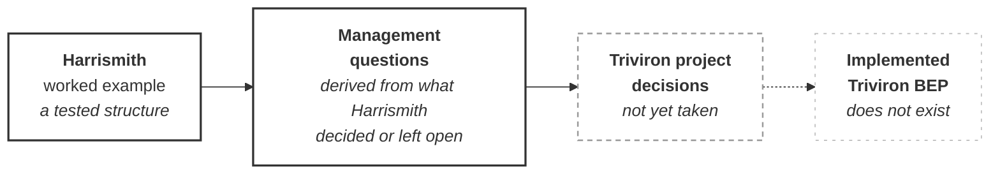

# M01-S14 — Harrismith-to-Triviron transfer

| Field | Value |
|---|---|
| **Visual identifier** | `M01-S14` |
| **Related slide** | Slide 14 — What must Triviron decide for itself? |
| **Purpose** | Move from the worked example to the audience's own project — as questions, not answers |
| **Source format** | Mermaid `flowchart` + Markdown transfer table |
| **Source documents** | The unresolved-matters sections across all seven principal sources; `teaching/module-01-what-is-a-bep/source-map.md` subject 10 and §6. **No Triviron source exists** |
| **Evidence classification** | **TEACHING SYNTHESIS** for the closing message, the three takeaways and the transfer chain; **DIRECT** for each question's derivation from a recorded Harrismith gap |
| **Known limitation** | ***Triviron* appears nowhere in this repository.** No Triviron information requirements, appointments, delivery dates, contractual programme, team structure, platform choice or scope exists. **No Triviron fact may be asserted** |
| **Last increment** | T1-D |

---

## 1. Primary diagram — the transfer chain

**Two required design decisions:**

1. **The final box is drawn in outline only** — dashed, unfilled, visibly
   not-yet-real. It is a destination, not a plan. Anything resembling a schedule,
   phase count or scope estimate would assert Triviron decisions that do not
   exist.
2. **The arrow into it is dashed.** The first two boxes describe what exists; the
   third describes decisions nobody has taken; the fourth describes work nobody
   has started.

## 2. Questions for the slide — five or six, not thirteen

The full list of thirteen belongs in the notes and any handout. **The slide shows
five or six.** Recommended selection, covering requirements, authority and
evidence:

| # | Question | Derived from |
|---|---|---|
| 1 | What information does the client actually require? | No client information requirements available to Harrismith; none invented |
| 2 | Who is the appointing / project-authority function? | Appointing Party identity **TBD** |
| 3 | Who leads delivery, and who holds information management? | LDP, BM, BC holders **TBD** |
| 7 | What are the real project milestones and delivery events? | Harrismith has **no dates**; all timing event-triggered or TBD |
| 9 | Who reviews, authorises, publishes, receives and accepts? | Publication/exchange and acceptance authority both **UNRESOLVED** |
| 13 | What evidence will demonstrate that the BEP has been implemented? | Slide 13's distinction applied |

**Every item is a question.** None may be shown with an answer, a placeholder
answer, or an example answer.

## 3. Transfer table — what carries across and what does not

| Transfers as method or structure | Does **not** transfer without project-specific decisions |
|---|---|
| The thirteen-section architecture | Any role holder |
| The six-resource division of labour | Any date or milestone |
| The seven-term responsibility grammar | Any CDE structure decision |
| The four-state CDE model | Any authority allocation |
| The separation of check / authorise / review / coordinate / accept | Any information requirement |
| The discipline of recording assumptions and unresolved decisions | Any container allocation |

The honest framing, worth saying aloud: **Harrismith's open questions are
Triviron's required decisions.**

## 4. Closing message

> Harrismith does not give Triviron a completed BEP. It gives us a tested
> structure, a set of management questions and a worked example of how
> project-specific decisions should be recorded.

**Teaching synthesis.**

## 5. Audience takeaway — three ideas

Optional closing build.

1. A BEP creates an **agreed method** for managing project information.
2. Supporting matrices, schedules and strategies turn that agreement into an
   **operating system**.
3. Every real project must **complete and implement** that system for its own
   appointments, requirements and delivery conditions.

## 6. Simplification and omission

| Simplify | Omit |
|---|---|
| Four boxes in the chain | The full thirteen-question list |
| Five or six questions beneath | **Every Triviron fact, name, date, organisation, platform choice and requirement** |
| Six rows per transfer column | Any tick, progress indicator or completion state on the final box |
| — | Any corporate or Triviron brand identity — **not chosen in this increment** |

## 7. Overclaim risk

**High, and of a specific kind.**

This is the final slide, the audience wants answers, and there is nothing in the
repository to draw on. Any Triviron detail placed here — however plausible — will
be quoted back afterwards as a decision.

The questions **are** the deliverable. The audience should leave with the work.
