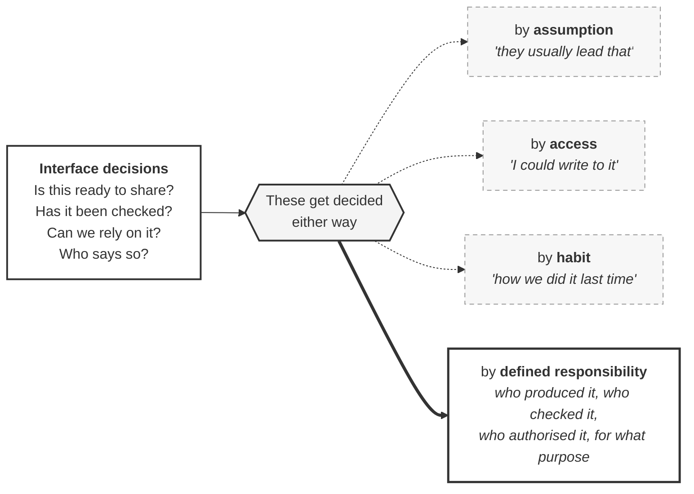

# M02-S01 — BIM roles exist to make decisions explicit

| Field | Value |
|---|---|
| **Visual identifier** | `M02-S01` |
| **Related slide** | Slide 1 |
| **Slide title** | BIM roles exist to make decisions explicit |
| **Teaching purpose** | Show that interface decisions get made either way — deliberately, or by assumption, access or habit |
| **Principal sources** | `bep/Harrismith-Fire-Station-BEP.md` §1.1, §1.5, §4.8, §5.1, §5.4 |
| **Evidence classification** | **DIRECT** for the three closures and the traceability requirement; **SYNTHESIS** for the central framing |
| **Known limitation** | **The three accidental routes are generic project conditions, not recorded Harrismith failures.** The sources record observations, not failures; the only recorded discrepancy is a team-space mapping observation |
| **Presentation warning** | Never caption any route as something that happened on Harrismith. Avoid any organisational-chart form |
| **Increment** | T2-D |

---

## 1. Diagram source

## 2. Reading the diagram

The hub is the argument: **the decisions happen regardless**. Four routes lead
out of it. Three are dashed, because nobody decided to take them. One is solid,
because someone did.

The three dashed routes are drawn as *equally available*, not as errors — they
are what happens in the absence of a decision, which is different from a mistake.

## 3. The three closures — each directly sourced

| Route | What the source says |
|---|---|
| **Assumption** | *"Architecture is not automatically the Lead Delivery Party"* — an observation about files is not an appointment (BEP §5.4) |
| **Access** | **"Authority is never inferred upward from platform configuration"** (BEP §1.5) |
| **Habit** | Reconfiguring a team, space, permission or mapping *"does not constitute a governance decision, and does not make itself legitimate by having been done"* (BEP §4.8) |

The solid route's content is BEP §5.1's traceability requirement, verbatim: for
any container it must be answerable **who produced it, who checked it, who
authorised it and for what purpose**.

## 4. Central framing — teaching synthesis

> If responsibility is not assigned deliberately, the project still makes
> decisions — but through assumption, access or habit.

**Teaching wording.** Consistent with §1.5, §4.8 and §5.9; no source sentence
says it. Label or footnote accordingly.

## 5. Simplification and omission

| Simplify | Omit |
|---|---|
| Four interface questions, one line each | Any Harrismith-specific incident or failure |
| Three dashed routes, one solid | Any discipline name — these are universal conditions |
| One traceability node | Any org-chart shape, tier or reporting line |

**If four questions crowd the entry node**, reduce to two and speak the rest.
Do not shrink the type.

## 6. Overclaim risk

**Low as drawn; high if captioned wrongly.** The single failure mode is a caption
implying these routes describe Harrismith's history. They do not, and the
repository records no failures at all.
