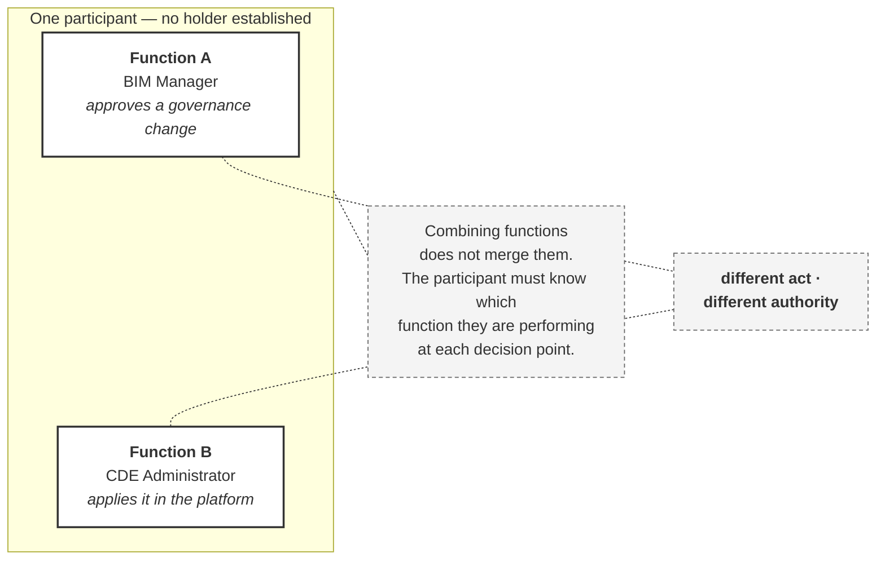

# M02-S02 — A role is not the same as a job title

| Field | Value |
|---|---|
| **Visual identifier** | `M02-S02` |
| **Related slide** | Slide 2 |
| **Slide title** | A role is not the same as a job title |
| **Teaching purpose** | Separate project function from job title from person, and show that one participant may carry several functions without merging them |
| **Principal sources** | `bep/Harrismith-Fire-Station-BEP.md` §4.6, §5.4, §5.5, §5.11 |
| **Evidence classification** | **DIRECT** — "These are functions, not job titles and not people"; the one-participant-two-functions example; explicit delegation; access is not delegation |
| **Known limitation** | **No person is named anywhere.** No holder is established in the Harrismith set. The participant in the diagram is a neutral container, not an individual |
| **Presentation warning** | Do not use a human silhouette, avatar or photograph — it invites "who is that?". Do not drift into Slides 5–6's BIM Manager boundaries |
| **Evidence source consumed** | `R1` — Function versus person |
| **Increment** | T2-D |

---

## 1. Diagram source

## 2. Why this example and not another

BEP §5.11 supplies it directly, and it is stronger than anything invented:

> Approving a governance change as **BIM Manager** is a different act from
> applying it as **CDE Administrator**, even when performed by one person within
> a minute of each other.

One person. One minute. Two functions. Two different authorities.

## 3. Companion panel — three concepts

**Table, not a diagram.** A flowchart would imply a derivation between them, and
there is none.

| Concept | What it is | Established on Harrismith? |
|---|---|---|
| **Project function** | What must be done or decided | **Yes** — four IM functions; nine matrix roles |
| **Job title** | A label an organisation gives a person | Not a project construct at all |
| **Person** | Who performs the function | **No** — all holders TBD |

The sourced statement that carries the panel, from BEP §4.6:

> These are functions, not job titles and not people.

## 4. Two further sourced points

| | |
|---|---|
| **Delegation must be explicit** — stated, scoped, recorded | BEP §5.11 |
| **Platform access is not delegation.** Being able to perform an action in the software does not mean authority to decide it was delegated | BEP §5.11 |

## 5. Simplification and omission

| Simplify | Omit |
|---|---|
| Two function boxes inside one neutral container | **Any name, avatar, silhouette or photograph** |
| One dashed connector carrying "different act, different authority" | Any job title used as if it were a role |
| One note | The BIM Manager's full boundary list — that is Slide 6 |

## 6. Design constraint

**The container is not a person.** Label it *one participant* or *one
individual*, unfilled and neutral. A human figure invites the audience to
identify someone in the room, and the module names nobody.

## 7. Overclaim risk

**Low.** The only exposure is a figure that reads as a specific person, or a job
title placed in the diagram as though it conferred the function.
