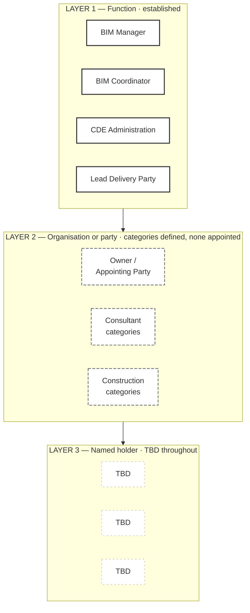

# M02-S03 — Function, organisation and named person

| Field | Value |
|---|---|
| **Visual identifier** | `M02-S03` |
| **Related slide** | Slide 3 |
| **Slide title** | Function, organisation and named person |
| **Teaching purpose** | Show three layers, with Harrismith's third deliberately empty — and why that is a planning state rather than a defect |
| **Principal sources** | `bep/Harrismith-Fire-Station-BEP.md` §4.2, §4.6, §5.2; `supporting/information-management-responsibility-matrix.md` §2, §5; `supporting/model-information-responsibility-matrix.md` preamble |
| **Evidence classification** | **DIRECT** for each layer's content and status; **INTERPRETATION** for the three-layer stack itself; **SYNTHESIS** for the planning-value argument |
| **Known limitation** | Layer 3 is **TBD throughout**. Layer 2 has categories but **no appointed organisation**. Neither may be shown as pending-with-a-date |
| **Presentation warning** | **No name-shaped placeholder in layer 3.** An empty cell, a dash or `TBD` is correct; a bracketed name token or initial-and-surname reads as a name |
| **Evidence source consumed** | `R1`, `R2` — Three-layer model |
| **Increment** | T2-D |

---

## 1. Diagram source

## 2. Three layer states, three treatments

| Layer | State | Treatment |
|---|---|---|
| **1 — Function** | **Established** — four IM functions at organisation level; nine matrix roles | Solid, populated |
| **2 — Organisation / party** | **Categories defined; none appointed.** A training organisation model under TA-03 | Dashed outline, categories only |
| **3 — Named holder** | **TBD throughout** — *"No names are populated"* | Faint dashed, `TBD` only |

**The progressive fading is the message.** A uniformly solid three-band diagram
would assert a staffed structure; a diagram omitting layer 3 would hide the gap.

## 3. The four IM functions — note it is four

BEP §4.6 establishes exactly these at organisation level:

| Function | Concern |
|---|---|
| BIM Manager | Governance of the information-management framework |
| BIM Coordinator | Operational multidisciplinary coordination |
| CDE Administration | Implementation of approved governance in the platform |
| Lead Delivery Party | Project-level delivery coordination |

**Do not label this "five functions".** Module 1's five-act framing is
presentation synthesis and enumerates different things — see the Module 2 source
map §8.

## 4. Companion panel — five concepts, not interchangeable

Optional second build. BEP §4.2, and the sharpest version of this slide's point:

| Concept | What it is |
|---|---|
| **Party** | An organisation |
| **Task team** | The group producing a defined package of information |
| **Discipline** | A technical classification of information |
| **Autodesk collaboration team** | A platform construct |
| **IM role** | A governance function |

> These may map to one another — often they do — but **a mapping is not an
> identity**.

## 5. Two things that must both be said

| | |
|---|---|
| **TBD is not failure** | BEP §5.2 presents unpopulated holders as the normal state of a *conceptual functional model, not an appointment chart* |
| **Documented is not implemented** | Layer 1 being populated does not mean the framework is operating |

**Caption requirement:** *defined, not yet operating*. Without it, a populated
top band does the overclaiming the words are careful to avoid.

## 6. Simplification and omission

| Simplify | Omit |
|---|---|
| Three bands; four functions, three category groups, three `TBD` cells | Any name-shaped placeholder in layer 3 |
| One caption | Any company in layer 2 |
| — | The full nine-role matrix; any tick, percentage or progress indicator |

## 7. Overclaim risk

**Medium, in both directions.** A tidy three-band stack implies layer 3 is merely
pending — it is unresolved, with no date. And a fully solid layer 1 implies an
operating system. The dashing and the caption between them prevent both.
