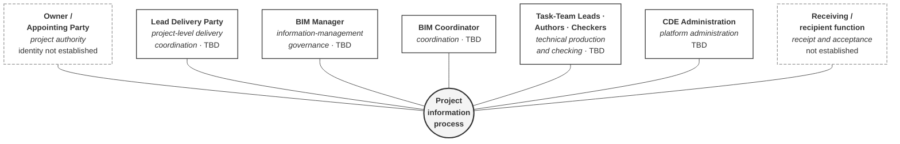

# M02-S04 — Who governs the project information process?

| Field | Value |
|---|---|
| **Visual identifier** | `M02-S04` |
| **Related slide** | Slide 4 |
| **Slide title** | Who governs the project information process? |
| **Teaching purpose** | Show the principal functions as a **functional map around the information process** — governance distributed by function, each with a boundary |
| **Principal sources** | `bep/Harrismith-Fire-Station-BEP.md` §4.6, §5.2, §5.4, §5.7; `supporting/information-management-responsibility-matrix.md` §2 |
| **Evidence classification** | **DIRECT** for the functions, roles and holder status; **INTERPRETATION** for the ring arrangement and the seven-concern grouping |
| **Known limitation** | **Every holder is TBD or not established.** A complete-looking ring implies a staffed structure |
| **Presentation warning** | **If the diagram has a visual top role, it is wrong.** BEP §5.2: *a conceptual functional model, not an appointment chart and not an organisation chart* |
| **Increment** | T2-D |

---

## 1. Mandatory layout rule

**No hierarchy, in any form.**

| Permitted | Prohibited |
|---|---|
| A ring | A pyramid |
| A horizontal functional band | An organisation tree |
| A balanced grid | Vertical reporting lines |
| A non-hierarchical network | BIM Manager at the top |
| — | BIM Coordinator above discipline leads |

BEP §5.7 closes the last one directly: **"Technical authority sits here, not with
the BIM functions."**

## 2. Diagram source — ring form

**Plain connectors, not arrows.** Each function *relates to* the process; none
flows into another. Arrowheads would imply sequence or subordination.

**`AP` and `RCP` are dashed** because their identity and authority respectively
are **not established**, not merely unstaffed.

## 3. Seven concerns, deliberately separated

| Concern | Held by |
|---|---|
| **Project authority** | Owner / Appointing Party — identity **not established** |
| **Information-management governance** | BIM Manager |
| **Technical production** | Author, within the task team |
| **Technical checking** | Checker |
| **Coordination** | BIM Coordinator |
| **Platform administration** | CDE Administration |
| **Receipt and acceptance** | Receiving / recipient function — acceptance authority **UNRESOLVED** |

**These are not layers of seniority.** They are different questions, and the
visual must not order them.

## 4. Secondary panel — the nine matrix roles

Small, beneath or beside the ring. Optional.

| `AP` · `LDP` · `BM` · `BC` · `TTL` · `Aut` · `Chk` · `CDE` · `Rcp` |
|---|
| **Every holder TBD or not established** |

`Rcp` carries its own source qualifier: *"a generic function, not an
organisation… whoever receives a given exchange under the approved delivery
arrangement, which does not yet exist."*

## 5. Simplification and omission

| Simplify | Omit |
|---|---|
| Seven nodes around one core; one-line concern each | **Any vertical stacking, tier or reporting line** |
| The nine-role list as a small secondary strip | Any holder name |
| One TBD indication, visible | The full nine-column matrix grid |

## 6. Requirement — TBD must be visible

The `TBD` status appears on the slide, not only in the notes. A functional map
without it reads as a staffed structure, and the audience will assume the roles
are filled.

## 7. Overclaim risk

**Medium.** A tidy, complete ring implies an operating governance structure.
Caption it as the **functional model**, and keep the holder status on the face of
the slide.
