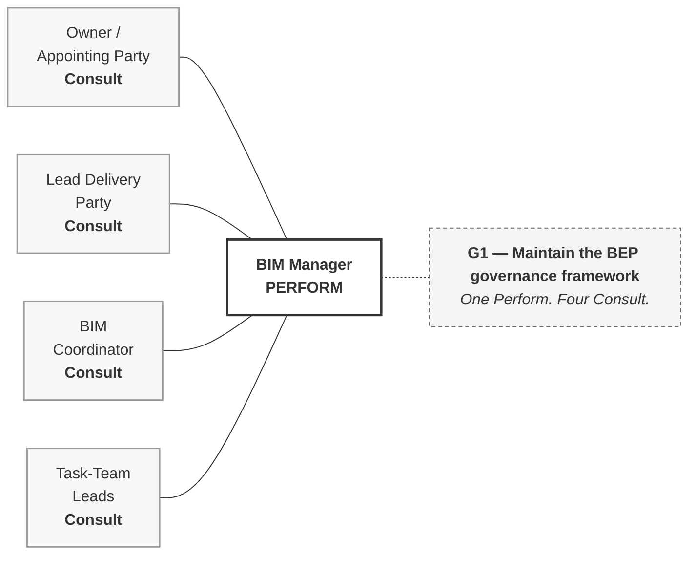

# M02-S05 — What does the BIM Manager actually do?

| Field | Value |
|---|---|
| **Visual identifier** | `M02-S05` |
| **Related slide** | Slide 5 |
| **Slide title** | What does the BIM Manager actually do? |
| **Teaching purpose** | A positive functional account, anchored on one responsibility-matrix row |
| **Principal sources** | `bep/Harrismith-Fire-Station-BEP.md` §5.5; `supporting/information-management-responsibility-matrix.md` §3.1, §3.2, §3.7 |
| **Evidence classification** | **DIRECT** — the §5.5 responsibility list and every matrix cell shown |
| **Known limitation** | Holder **TBD**. The function is the principal *governance* function, not the principal project function |
| **Presentation warning** | **No exclusions on this slide.** Slide 6 owns them; pre-empting collapses the pair into one defensive slide |
| **Evidence source consumed** | `R3`, `R5` |
| **Increment** | T2-D |

---

## 1. Primary visual — the G1 strip

Five cells. This is the anchor, and if space is tight it is the element to keep.

**Plain connectors.** The four consulted roles are *inputs to* the row, not
subordinates. No arrowheads.

**The message the strip carries:** drafting is concentrated; agreement is
distributed. Those four cannot write it, and cannot be bypassed.

## 2. Companion panel — the function's responsibilities

Five or six on the slide, from BEP §5.5's nine. **Table, not a diagram** — a
flowchart would imply a sequence that does not exist.

| The BIM Manager |
|---|
| Maintains the BEP governance framework |
| Maintains the CDE strategy |
| Maintains the responsibility architecture |
| Manages governance decisions and controlled changes |
| Performs governance assurance |
| Checks that approved governance is reflected in platform and process configuration |

*(Three further, if space allows: coordinates information standards; coordinates
delivery-planning governance; supports onboarding and BIM capability
development.)*

## 3. Where the matrix puts it — optional second panel

| Row | Function | `BM` |
|---|---|---|
| G1 | Maintain the BEP governance framework | **P** |
| G2 | Manage governance decisions and the change process | **P Co** |
| G3 | Maintain the IM responsibility architecture | **P** |
| **G4** | **Maintain and coordinate project information standards** | **Co** *(Task-Team Lead performs)* |
| G5 | Provide BIM onboarding and capability support | **P** |
| C1 | Define the CDE governance strategy | **P** |
| A1 / A5 | Assess governance change / retain evidence | **P Co** / **P** |
| C4 / A4 | Verify configuration / implementation after change | **Ck** |

## 4. Preserve the G4 nuance

**G4 must survive any compression.** Even on project information standards the
BIM Manager is marked `Co` while the Task-Team Lead is `P Cs`. The function is
narrower than its title suggests, and the matrix says so without commentary.

If the matrix panel is cut for space, G4 moves into the spoken commentary — it
does not disappear.

## 5. Simplification and omission

| Simplify | Omit |
|---|---|
| The G1 strip, enlarged | **Any exclusion** — Slide 6 owns them |
| Six responsibilities, not nine | The full seven-sub-table matrix |
| The matrix panel to eight rows | The AG-series training-only governance functions |
| — | Any holder name |

## 6. Overclaim risk

**Low.** The content is directly sourced. The only exposure is a slide that
implies the function holds general project authority — which is why the
exclusions are held back rather than softened here.
