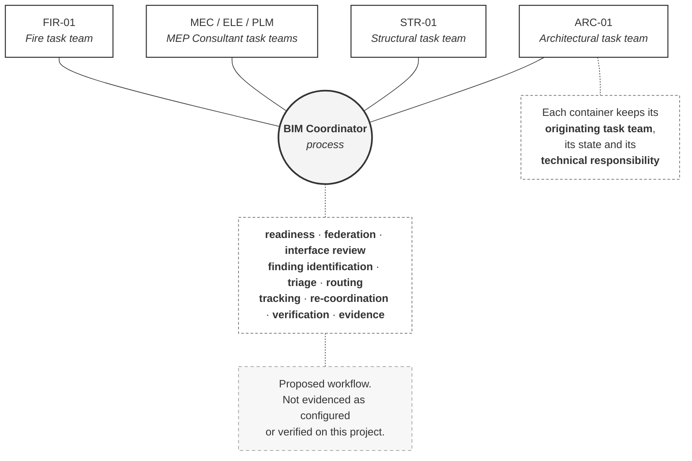

# M02-S07 — What does the BIM Coordinator do?

| Field | Value |
|---|---|
| **Visual identifier** | `M02-S07` |
| **Related slide** | Slide 7 |
| **Slide title** | What does the BIM Coordinator do? |
| **Teaching purpose** | Place the coordinator at the **centre of a process**, not the top of an organisation — with task teams retaining ownership of their own information |
| **Principal sources** | `bep/Harrismith-Fire-Station-BEP.md` §5.6; `supporting/coordination-review-strategy.md` §3, §8, §12; `supporting/information-management-responsibility-matrix.md` §3.5; `supporting/model-information-responsibility-matrix.md` §3.1, §3.4 |
| **Evidence classification** | **DIRECT** for the activities, the matrix rows and all three cautions |
| **Known limitation** | **Not evidenced as running.** No Design Collaboration Coordination Space was observed configured (`OF-005`); the issue status model is **not claimed to be configured**; tolerances **TBD**; cycle frequency **not established** |
| **Presentation warning** | **Caption as the governed model, not an operating process.** No product name, no screenshot, no clash count |
| **Evidence source consumed** | `R3`, `R6` |
| **Increment** | T2-D |

---

## 1. Diagram source

## 2. Two mandatory design decisions

**Each container carries its originating task-team label.** A central coordinator
surrounded by unlabelled containers implies the coordinator owns them — the exact
inference this slide exists to prevent.

**Plain connectors, not arrows.** The coordinator *relates to* each container
through the process. An arrow into the coordinator would imply the containers
flow to them; an arrow out would imply direction of work.

## 3. The activities — direct source

BEP §5.6 and Coordination Strategy §3:

| The BIM Coordinator |
|---|
| Organises coordination inputs; identifies required inputs |
| Manages federation |
| Manages and coordinates checks; runs or coordinates interface review |
| Triages findings |
| Creates and coordinates managed Issues **where required** |
| Coordinates assignment; monitors assigned actions |
| Coordinates re-review and re-coordination |
| Verifies the coordination disposition |
| Escalates blockers and unresolved interface problems |
| Retains and reports coordination evidence |

## 4. Where the matrix puts it

| Row | Function | `BC` |
|---|---|---|
| X1 | Organise coordination inputs | **P Co** |
| X2 | Perform / manage the multidisciplinary coordination process | **P Co** |
| **X3** | **Resolve technical coordination issue** | **`Co`** *(TTL and Aut are `P`)* |
| X4 | Verify coordination resolution / process disposition | **Ck** |
| X5 | Escalate unresolved multidisciplinary interfaces | **P** |

**X3 is the row that settles the design question** and should survive any
compression.

## 5. Four things the visual must not imply

| Must not imply | Source position |
|---|---|
| The coordinator designs discipline solutions | *"May facilitate agreement between teams but does not author a discipline solution merely because they chair coordination"* |
| Every finding becomes an Issue | Creating one is a **decision taken at triage**, not an automatic consequence of detection |
| Federation merges ownership | `COORD-01` does not merge authorship, transfer technical ownership, create a new design author, or replace the discipline containers |
| Coordination grants publication authority | The coordinator does not *"acquire publication authority through coordination"* |

## 6. Simplification and omission

| Simplify | Omit |
|---|---|
| Four container groups, not six | The sixteen-step cycle — that is Module 6 |
| Five activities on the slide; ten in the notes | **Any product name or screenshot** |
| One warning node | Any clash count; any tolerance value (**TBD** in source) |
| — | Any meeting or cycle frequency (**not established**) |

## 7. Overclaim risk

**High.** A clean central-coordinator diagram reads as a process that runs. The
warning node is mandatory if the activity panel is shown, and the caption is
*governed model*, never *coordination process in operation*.
