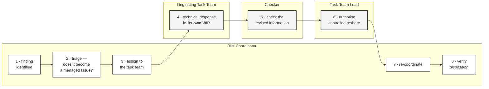

# M02-S08 — Coordination responsibility is not design responsibility

| Field | Value |
|---|---|
| **Visual identifier** | `M02-S08` |
| **Related slide** | Slide 8 |
| **Slide title** | Coordination responsibility is not design responsibility |
| **Teaching purpose** | Walk one matter end to end and show responsibility crossing to the task team and returning — with the technical content never leaving the originating team |
| **Principal sources** | `supporting/coordination-review-strategy.md` §16, §17, §18, §19, §27; `supporting/information-management-responsibility-matrix.md` §3.5 |
| **Evidence classification** | **DIRECT** for the steps and all five boundaries; **INTERPRETATION** for the eight-step compression of the source's sixteen |
| **Known limitation** | The STR-01 / MEC-01 scenario is the source's own **"educational workflow example only"**, which *"does not describe an actual condition on the project"* — no geometry, coordinates, Issue identifier, tolerance value or named person |
| **Presentation warning** | **Label the example before using it.** A swimlane also looks like a configured workflow — caption as governed model, not running process |
| **Evidence source consumed** | `R3`, `R6` |
| **Increment** | T2-D |

---

## 1. Diagram source — four-lane handoff

## 2. The mandatory boundary

**Step 4 sits in the task team's lane and must visibly stay there.** The
technical response is emphasised — heavier border, filled background — because it
is the one step the coordinator does not touch.

**Responsibility crosses the lane twice and returns.** Steps 1–3 are the
coordinator's; 4–6 belong to the originating team and its own functions; 7–8
return to the coordinator. A left-to-right chain ending in the task team's lane
would imply the technical response terminates the matter. It does not.

**The coordinator must not appear to create the solution.** No arrow from the
coordinator lane into step 4 other than the assignment at step 3, and the
assignment is labelled *assign*, never *instruct* or *resolve*.

## 3. The five boundaries — all direct source wording

| # | |
|---|---|
| 1 | **"An Issue assigned to a task team does not make the BIM Coordinator responsible for designing the fix"** |
| 2 | Where multiple task teams must change, **"each remains responsible for its own information"** — a jointly-agreed resolution is still a set of separate changes under separate responsibility |
| 3 | **"A material Issue is not closed solely because someone says it was fixed in WIP"** — closure follows re-coordination against reshared, controlled information, because *"a change nobody can see in Shared information has not been demonstrated"* |
| 4 | **Closing an Issue is not design approval** |
| 5 | **"Verification does not equal design approval, professional certification, publication authority, or recipient acceptance"** |

**Show one call-out on the slide, not five.** Boundary 1 or 3 works best beside
the diagram; the rest belong in the speaker notes.

## 4. The illustrative example — label required

If the scenario is referenced:

> A mechanical service route conflicts with structural information —
> **STR-01** versus **MEC-01**.

**It carries the source's own label:** *an educational workflow example only*,
which *"does not describe an actual condition on the project."* The source states
that it contains **no actual project geometry, no clash coordinates, no Issue
identifier, no tolerance value, and no named person**.

**This is not a recorded live Harrismith clash**, and must never be captioned as
one.

The detail worth keeping: *if only MEC-01 changes, TRN-E02-MEC activates and
TRN-E02-STR does not.* Only affected containers reshare.

## 5. Simplification and omission

| Simplify | Omit |
|---|---|
| Four lanes, eight steps | Any geometry, clash coordinate, Issue identifier or tolerance |
| One boundary call-out | The sixteen-step source cycle in full |
| — | Any named person; any product name or screenshot |
| — | Any suggestion the example is a recorded event |

## 6. Overclaim risk

**High.** A swimlane is the visual language of configured workflow software, and
this process is **not evidenced as configured or running**. Keep the styling
plain — no status pills, no lane colour coding borrowed from a platform, no
completion markers.
