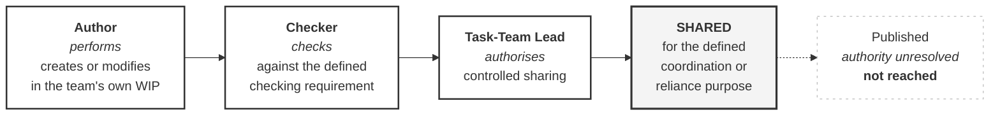

# M02-S09 — Task-Team Leads, Authors and Checkers

| Field | Value |
|---|---|
| **Visual identifier** | `M02-S09` |
| **Related slide** | Slide 9 |
| **Slide title** | Task-Team Leads, Authors and Checkers |
| **Teaching purpose** | The clearest separation of duties in the framework — three functions, one container, three different acts |
| **Principal sources** | `supporting/information-management-responsibility-matrix.md` §3.3 rows P1–P4 and both notes; `bep/Harrismith-Fire-Station-BEP.md` §5.7, §5.8, §7.6, §9.3, §9.4; `supporting/information-delivery-schedule.md` §3.2 |
| **Evidence classification** | **DIRECT** |
| **Known limitation** | **Publication authority is UNRESOLVED and the transition is BLOCKED.** The flow stops at `Shared` |
| **Presentation warning** | **No solid arrow from Shared to Published.** **No RACI letters** in the diagram, a legend or a key |
| **Evidence source consumed** | `R7` |
| **Increment** | T2-D |

---

## 1. Diagram source

## 2. The mandatory stop

**The flow stops at `Shared`.**

`Published` may appear **only** as a visibly unreached future state — dashed
outline, faint border, and labelled *authority unresolved*. Omitting it entirely
is also acceptable.

**What is not acceptable is a solid arrow to it.** Publication authority is
recorded as unresolved in three sources and the T4 transition is recorded as
blocked; drawing a solid link would invent an authority the sources refuse to
assign.

## 3. The anchor extract — rows P1 to P4

Four rows, four columns. **Read the `Aut` column downward** — that is the
teaching.

| # | Function | `Aut` | `Chk` | `TTL` | `BC` |
|---|---|---|---|---|---|
| P1 | Author information in WIP | **`P`** | — | `Co` | — |
| P2 | Perform task-team technical / content check | `Cs` | **`Ck`** | `Co Ck` | — |
| P3 | Perform information-quality / readiness check | `Cs` | **`Ck`** | `Co` | `Cs` |
| P4 | Authorise WIP information for controlled sharing | **`—`** | `Cs` | **`Au`** | `In` |

Perform · consult · consult · **nothing**. **The Author does not appear in the
authorisation row at all.**

Source statement: **"An Author does not self-authorise merely because they
authored the information."**

## 4. The four distinctions

| | Why they are not the same |
|---|---|
| **Perform ≠ Check** | Producing information is not verifying it against a requirement |
| **Check ≠ Authorise** | *"Checking confirms readiness for the next controlled decision"* — the progression is a separate decision |
| **Authorise for Shared ≠ Publish** | *"Authorisation to share is not authorisation to publish or exchange"* |
| **Publish ≠ Accept** | Acceptance is a separate act by an identified recipient — and that authority is **unresolved** |

## 5. Optional second panel — the same rule, applied

Information Delivery Schedule §3.2, every TRN-E01 row:

| Field | Value |
|---|---|
| Checking Requirement | Task-team technical/content check **and** information-quality/readiness check |
| Authorisation Requirement | **Task-Team Lead authorisation to share** |
| State / Suitability | **Shared — coordination use only** |

Three documents, one rule, stated once each.

## 6. Optional third panel — Author and Checker combined

Allowed on a project this size, with three conditions (BEP §5.8, §9.12; IM matrix
§5):

- the functional distinction remains — a self-check is still a checking act
  against a defined requirement;
- the combination is **recorded**, so the limitation is visible in the evidence;
- **"Independence is never claimed where it does not exist."**

## 7. RACI prohibition

**Do not annotate this diagram or its extract with RACI letters** — not in the
flow, not in the table, not in a legend or key.

BEP §5.12 and IM matrix §1 both state RACI is **not adopted**, and both give the
same reason: it collapses checking from authorising and coordinating from
performing — the exact distinctions this slide makes.

## 8. Simplification and omission

| Simplify | Omit |
|---|---|
| Four nodes; the extract cropped to four rows and four columns | **Any node or arrow beyond `Shared`, other than the dashed unreached state** |
| One panel at a time if space is tight | The full P-group table; the S-group rows |
| — | **Any RACI letter**; any holder name |

## 9. Overclaim risk

**Low if the chain stops at `Shared`; high if it does not.** This is the module's
load-bearing slide and its longest allocation — the one visual where a tidier
diagram would be a governance failure.
