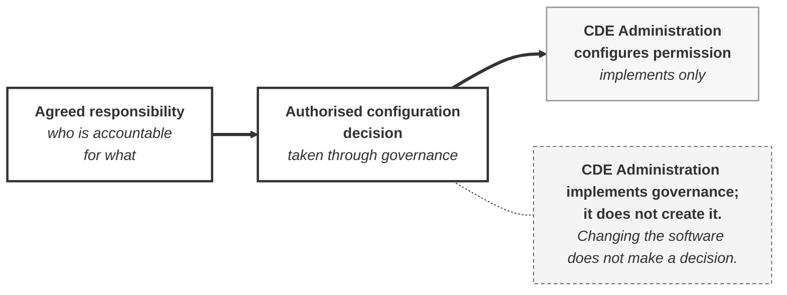
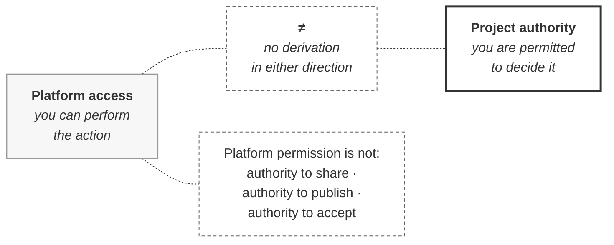

# M02-S10 — CDE Administration implements governance

| Field | Value |
|---|---|
| **Visual identifier** | `M02-S10` |
| **Related slide** | Slide 10 |
| **Slide title** | CDE Administration implements governance |
| **Teaching purpose** | Show the direction of travel from agreed responsibility to configured permission — and the prohibited reverse inference |
| **Principal sources** | `bep/Harrismith-Fire-Station-BEP.md` §4.6, §5.9, §5.11, §6.9, §9.7; `supporting/cde-workflow-state-strategy.md` §14, §17; `supporting/information-management-responsibility-matrix.md` §3.2, §3.7 |
| **Evidence classification** | **DIRECT** |
| **Known limitation** | Holder **TBD**. The function implements only — it holds no governance authority |
| **Presentation warning** | **No ACC permissions screenshot.** A permissions screen invites the inference that the access list is the authority list |
| **Evidence source consumed** | `R8` |
| **Increment** | T2-D |

---

## 1. Diagram source — the governed direction

**One direction, no return path.** A return arrow would assert that configuration
feeds back into governance — which BEP §6.9 and CDE Strategy §17 both refuse.

## 2. Diagram source — the prohibited inference

**No directional arrow between these two.** They are separate concepts, and the
connector carries `≠` rather than a relationship. Any arrow — in either direction
— would imply derivation.

## 3. Terminology, kept distinct

| Term | What it is | Source usage |
|---|---|---|
| **CDE Administration** | The **function** — one of four at organisation level | 25 occurrences |
| **CDE Administrator** | A **participant** carrying it | 5 occurrences, all in role-combination or list-of-people contexts |

**Teach the function form.** No such participant is established.

## 4. What the function does

BEP §5.9, and the matrix rows:

| Responsibility | Matrix |
|---|---|
| Project membership administration | `C3` — **P** |
| Folder and space implementation | `C2` — **P** |
| Permissions | `C3` — **P** |
| Design Collaboration team-space configuration | `C2` |
| Coordination-space configuration | `C2` |
| Platform workflow configuration | `C2` |
| Implementation of approved structural and configuration changes | `A3` — **P** |
| **Checking platform configuration after an approved change** | `C4` — **P Ck** |

## 5. Four sourced consequences

| # | |
|---|---|
| 1 | Write access does not create authorisation authority — *"Platform permission is not BEP authority"* |
| 2 | The CDE Administrator is named among roles that do **not** automatically hold publication authority (BEP §9.7) |
| 3 | *"Access is configured to support approved responsibility — the responsibility comes first, and the permission follows it"* |
| 4 | *"A configuration that was never approved is a deviation, however competently it was applied"* |

And the divergence rule: where access and approved responsibility diverge,
*"the divergence is a deviation to be recorded, not a redefinition of who is
responsible."*

## 6. Optional panel — the sourced example, no person named

BEP §5.11: one participant may carry **both** the BIM Manager and the CDE
Administrator functions.

> Approving a governance change as BIM Manager is a different act from applying
> it as CDE Administrator, even when performed by one person within a minute of
> each other.

**The same person, with full platform access, holds the authority in one capacity
and not the other.** Access was never the thing that decided it.

Worth one line, from the access section itself: **"No user names are specified in
this document."**

## 7. Simplification and omission

| Simplify | Omit |
|---|---|
| Two zones, one arrow; the `≠` panel as a second build | **Any ACC permission screenshot or settings dialog** |
| Five or six responsibilities, not eight | Any user name; any folder tree |
| — | Any bidirectional or return arrow |

## 8. Overclaim risk

**Low if the arrow runs one way; high if reversed or bidirectional.** The whole
slide is a claim about direction, and a diagram that lets configuration point
back at governance reverses it.

**Live observation would be actively counterproductive** here, for the same
reason a screenshot is prohibited.
