# M02-S11 — Check, authorise, publish, receive and accept

| Field | Value |
|---|---|
| **Visual identifier** | `M02-S11` |
| **Related slide** | Slide 11 |
| **Slide title** | Check, authorise, publish, receive and accept |
| **Teaching purpose** | Show the controlled decision chain with two links **visibly unheld**, and distinguish actions, state transitions, events and statuses |
| **Principal sources** | `bep/Harrismith-Fire-Station-BEP.md` §9.2–9.8, §10.10, §10.11; `supporting/cde-workflow-state-strategy.md` §3, §13; `supporting/information-management-responsibility-matrix.md` §3.3, §3.6 |
| **Evidence classification** | **DIRECT** for the acts, kinds and statuses; **INTERPRETATION** for the required message |
| **Known limitation** | **Publication authority UNRESOLVED and BLOCKED. Recipient acceptance UNRESOLVED / recipient-dependent.** Neither may be drawn as held |
| **Presentation warning** | **No complete solid route from Author to Accepted.** Unresolved steps are shown, never omitted |
| **Evidence source consumed** | `R9` |
| **Increment** | T2-D |

---

## 1. Diagram source

```mermaid
flowchart LR
    A["<b>Author</b><br/><i>act</i>"]
    C1["<b>Check</b><br/>technical / content<br/><i>act</i>"]
    C2["<b>Check</b><br/>information quality<br/><i>act</i>"]
    AU["<b>Authorise for Shared</b><br/><i>STATE TRANSITION</i><br/>Task-Team Lead"]
    U["<b>Use</b><br/>coordination or<br/>defined reliance<br/><i>action / context —<br/>not a state change</i>"]
    PUB["<b>Authorise publication<br/>/ exchange</b><br/><i>STATE TRANSITION</i><br/><b>UNRESOLVED · BLOCKED</b>"]
    DEL["<b>Deliver</b><br/><i>event</i>"]
    REC["<b>Receive</b><br/><i>event</i>"]
    ACC["<b>Accept</b><br/><i>status</i><br/><b>UNRESOLVED ·<br/>RECIPIENT-DEPENDENT</b>"]

    A --> C1 --> C2 --> AU --> U
    U -.-> PUB
    PUB -.-> DEL -.-> REC -.-> ACC

    classDef act fill:#ffffff,stroke:#333,stroke-width:1.5px;
    classDef transition fill:#f4f4f4,stroke:#333,stroke-width:2.5px;
    classDef notstate fill:#ffffff,stroke:#666,stroke-width:1.5px,stroke-dasharray: 2 2;
    classDef unheld fill:#ffffff,stroke:#999,stroke-width:2px,stroke-dasharray: 6 4;
    class A,C1,C2 act;
    class AU transition;
    class U,DEL,REC notstate;
    class PUB,ACC unheld;
```

## 2. Mandatory unresolved treatment

**Two links are unheld and must look it.**

| Step | Treatment |
|---|---|
| **Authorise publication / exchange** | Dashed border, explicit `UNRESOLVED` **and** `BLOCKED`. The link into it is dashed |
| **Accept** | Dashed border, explicit `UNRESOLVED` and `RECIPIENT-DEPENDENT` |

**Do not omit the steps.** An authority absent from the diagram reads as one that
does not exist, rather than one nobody holds. Both readings are wrong, but the
second is the accurate one.

**Do not draw a complete solid route from Author to Accepted.** The solid run
ends at `Use`; everything after the publication decision is dashed.

## 3. Four kinds, four treatments

Only two steps change the information state. The rest are actions, events and
statuses recorded *against* information whose state is unchanged.

| Kind | Steps | Treatment |
|---|---|---|
| **Act** | Author · both checks | Plain solid border |
| **State transition** | Authorise for Shared · Authorise publication | Heavy border, labelled `STATE TRANSITION` |
| **Action / context** | Use for coordination or reliance | Dotted border |
| **Event** | Deliver · Receive | Dotted border |
| **Status** | Accept | Dotted border, plus unresolved marking |

Source position: *"An event or a decision does not create a new information state
unless the governed state-transition rule explicitly says it does."*

## 4. Authority status strip — optional second panel

| Authority | Status |
|---|---|
| Controlled sharing | **ESTABLISHED** — Task-Team Lead |
| Publication / exchange | **UNRESOLVED · BLOCKED** |
| Recipient acceptance | **UNRESOLVED / RECIPIENT-DEPENDENT** |
| Technical / design approval | **OUTSIDE the IM allocation** |
| Governance change | **UNRESOLVED**, by change class |

## 5. The five distinctions

| | Source |
|---|---|
| **Check ≠ authorise** | *"Checking confirms readiness for the next controlled decision"* |
| **Authorise for Shared ≠ publish** | *"Authorisation to share is not authorisation to publish or exchange"* |
| **Publish ≠ receive** | *"A transmission record is not the information"*; *"A transmittal is not technical approval"* |
| **Receive ≠ accept** | *"Delivery does not prove acceptance. Receipt does not prove suitability."* |
| **Accept ≠ technical approval** | Acceptance applies to the identified purpose *"and to nothing beyond it"* |

And the closing position: **"No acceptance authorities are invented. Where the
accepting role remains unresolved, it remains TBD."**

## 6. Simplification and omission

| Simplify | Omit |
|---|---|
| Nine nodes; annotate kind only where not obvious | The full T1–T8 transition table — Module 4 territory |
| The authority strip as a second build | The sixteen delivery-schedule fields |
| — | **Any solid arrow into Publication or Accept** |
| — | Any named holder for an unresolved authority |

## 7. Required message

> "Approved" is too vague unless the project identifies what was decided, for
> which purpose and by which authority.

**Supported interpretation.** Generalises BEP §9.1's position that "approve" is
used only where a defined approval decision is intended and is not a catch-all.

## 8. Overclaim risk

**High if the chain is drawn complete.** A left-to-right sequence implies
completion, and two of its links have no holder. The dashing is the accuracy, not
the styling.
