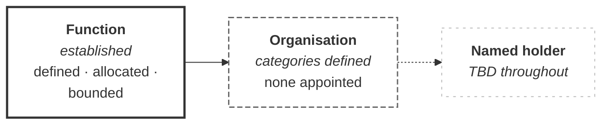

# M02-S13 — Harrismith names functions but not role holders

| Field | Value |
|---|---|
| **Visual identifier** | `M02-S13` |
| **Related slide** | Slide 13 |
| **Slide title** | Harrismith names functions but not role holders |
| **Teaching purpose** | Separate a governance framework from an implemented appointment structure, and give both halves of the argument |
| **Principal sources** | `bep/Harrismith-Fire-Station-BEP.md` §4.2, §4.6, §5.1, §5.2, §5.11, §6.9, §9.10, §10.11, §12.9; `supporting/information-management-responsibility-matrix.md` §2, §4, §6; `supporting/model-information-responsibility-matrix.md` preamble |
| **Evidence classification** | **DIRECT** for both establishment lists; **INTERPRETATION** for the necessity arguments; **SYNTHESIS** for the required message and the planning-value arguments |
| **Known limitation** | Every project role holder is **TBD or not established**. No organisation is appointed. No contractual signatory is assigned |
| **Presentation warning** | **Neither "the framework is broken" nor "the framework is running".** Both halves must appear |
| **Evidence source consumed** | `R2`, `R10` |
| **Increment** | T2-D |

---

## 1. Primary visual — balanced comparison

**Table form.** The two lists are contrasted, not connected; a diagram would
imply a transformation between them.

| **ESTABLISHED** | **NOT ESTABLISHED** |
|---|---|
| Role definitions — nine functional roles, four IM functions | Named holders — *"No names are populated"* |
| The responsibility grammar — seven terms | Appointed organisations — categories only |
| Process allocations — 25 IM functions | Contractual signatories — *"no real contractual signatory is assigned"* |
| Functional boundaries — *Holds / Does not hold* for each role | Complete publication authority — **UNRESOLVED** |
| Some authority allocations — controlled sharing established | Complete acceptance authority — **UNRESOLVED** |
| **Records of what remains unresolved** | Complete implementation-verification responsibility — *"no single universal verifier is defined"* |

**Equal weight.** The right column is not a deficiency list; it is the other half
of an honest position.

## 2. Secondary visual — the three-layer mapping

**Progressive weakening, and a dashed final link.** Layer 1 solid; layer 2 dashed
outline; layer 3 faint. The link into layer 3 is dashed because nothing connects
them yet.

**No name-shaped placeholder in layer 3.** An empty cell, a dash or `TBD` is
correct; a bracketed name token or an initial-and-surname reads as a name, and
inventing one is what the module prohibits.

## 3. Both truths — the required balance

| **Why functions before names is legitimate** | **Why named holders are eventually necessary** |
|---|---|
| The project can define **what must be done** before knowing who will do it | Work cannot be implemented by abstract functions alone |
| Appointments can later be **mapped to stable functions** | Accountability requires an **assigned participant** |
| **One person can carry several functions** without merging them | **Permissions must map to an authorised holder** — access follows responsibility, and responsibility needs an owner |
| Governance can be **reviewed and agreed** while the team is still forming | Delivery and escalation need a **known contact** |
| — | **Implementation evidence must identify who acted** |

The last row is BEP §5.1's requirement, and it is what turns the argument from
opinion into consequence: for any container it must be answerable **who produced
it, who checked it, who authorised it and for what purpose**. Four questions that
need people, not functions.

## 4. Two prohibitions, both required on the slide

| Do not | Because |
|---|---|
| **Present TBD holders as evidence the framework is invalid** | BEP §5.2 and IM matrix §2 present unpopulated holders as the normal current state of a *conceptual functional model* |
| **Present the framework as implemented because the functions are documented** | Documenting a function is not operating it |

**The second is the one presenters miss.** A slide listing everything Harrismith
establishes reads as a working system unless the limit is stated. A caption such
as *defined, not yet operating* prevents the left column doing the overclaiming.

## 5. One further sourced line

From the CDE access section, where names would most naturally have appeared:

> **No user names are specified in this document.**

## 6. Simplification and omission

| Simplify | Omit |
|---|---|
| Six rows per column | Any name-shaped placeholder |
| Three-layer strip beneath, small | Any company in the organisation layer |
| Two or three balance rows, not five | Any tick, percentage or progress indicator |
| — | The governance register's full summary; the AG-series |

## 7. Required message

> A function can be defined before a person is appointed, but it cannot be
> implemented indefinitely without a named holder.

**Teaching synthesis.** The sources record the state; the argument about its
limit is the presenter's.

## 8. Overclaim risk

**Inverted, and in two directions.** Showing only the right column makes
Harrismith look broken; showing only the left makes it look operational. The
balanced treatment and the caption are what keep it accurate.
