# M02-S14 — What must Triviron assign before delivery begins?

| Field | Value |
|---|---|
| **Visual identifier** | `M02-S14` |
| **Related slide** | Slide 14 |
| **Slide title** | What must Triviron assign before delivery begins? |
| **Teaching purpose** | Convert the role-and-authority model into a project-startup checklist — as questions |
| **Principal sources** | The unresolved records across all seven controlled sources; `bep/Harrismith-Fire-Station-BEP.md` §6.9 for the ordering rule. **No Triviron source exists** |
| **Evidence classification** | **SYNTHESIS** for the sequence and close; **DIRECT** for each question's derivation from a recorded Harrismith gap |
| **Known limitation** | **No Triviron appointments, organisational structure, programme, information requirements or authority decisions exist in this repository** |
| **Presentation warning** | **No Triviron fact may be asserted.** Every item is a question. The final state is future-facing and never shown as complete |
| **Evidence source consumed** | `R11` |
| **Increment** | T2-D |

---

## 1. Diagram source — seven-stage sequence

```mermaid
flowchart LR
    S1["<b>1 · Contractual<br/>authority</b><br/><i>appointing party ·<br/>lead delivery party</i>"]
    S2["<b>2 · Information-<br/>management functions</b><br/><i>BIM Manager · Coordinator ·<br/>CDE Administration</i>"]
    S3["<b>3 · Discipline and<br/>task-team functions</b><br/><i>Task-Team Leads ·<br/>Authors · Checkers</i>"]
    S4["<b>4 · Decision<br/>authorities</b><br/><i>share · publish ·<br/>receive · accept ·<br/>design approval</i>"]
    S5["<b>5 · CDE<br/>permissions</b><br/><i>configured to follow<br/>the allocations</i>"]
    S6["<b>6 · Named holders<br/>and deputies</b><br/><i>including multi-function<br/>participants</i>"]
    S7["<b>7 · Implementation<br/>verification</b><br/><i>who confirms it is<br/>being followed</i>"]

    S1 --> S2 --> S3 --> S4 --> S5 --> S6 -.-> S7

    classDef stage fill:#ffffff,stroke:#333,stroke-width:1.5px;
    classDef future fill:#ffffff,stroke:#bbb,stroke-width:1px,stroke-dasharray: 3 5;
    class S1,S2,S3,S4,S5,S6 stage;
    class S7 future;
```

## 2. Two mandatory rules

### 2.1 Sequence rule — permissions come fifth

**`CDE permissions` appears only after `decision authorities`.**

This is BEP §6.9's rule, not a layout preference:

> Access is configured to support approved responsibility — **the responsibility
> comes first, and the permission follows it.**

Drawing permissions earlier would teach the exact mistake the module spends Slide
10 correcting. A project that configures the CDE first has made its authority
decisions by accident.

### 2.2 Future-state rule

**Stage 7 is outline only** — dashed, faint, and visibly not-yet-real. The link
into it is dashed.

Nothing about it may read as achieved, in progress, scheduled or estimated. **No
tick, no percentage, no completion marker, no date.**

## 3. Question panel — five or six on the slide

The full set belongs in the notes and any handout.

| # | Question | Derived from |
|---|---|---|
| 1 | Which organisation is the Owner / Appointing Party? | Identity **not established** |
| 2 | Which organisation acts as Lead Delivery Party? | Holder **TBD** |
| 3 | Who performs the BIM Manager and BIM Coordinator functions? | Both **TBD** |
| 4 | Who authorises information for Shared? | Function established; **holder TBD** |
| 5 | Who holds publication / exchange authority, and who may accept? | Both **UNRESOLVED** |
| 6 | What evidence will show the process is being implemented? | *"No single universal verifier is defined"* |

**Every item is a question.** None may be shown with an answer, a placeholder
answer or an example answer.

## 4. Full question set — appendix or handout

| Stage | Questions |
|---|---|
| **1** | Which organisation is the Owner / Appointing Party? Which acts as Lead Delivery Party? |
| **2** | Who performs the BIM Manager function? The BIM Coordinator function? Who administers the CDE? |
| **3** | Who are the Task-Team Leads for each discipline? Who may author information? Who performs the required technical and information-quality checks? |
| **4** | Who authorises information for Shared? Who holds publication or exchange authority? Who receives each delivery? Who may accept it? Who holds technical or design approval authority? |
| **5** | Which permissions follow each responsibility? |
| **6** | Which participants may hold more than one function, and how will those functions remain distinguishable? |
| **7** | Who verifies that the agreed BIM process is being implemented? |

## 5. The honest framing

> **Harrismith's open questions are Triviron's required decisions.**

Each question traces to a recorded gap: appointing party **not established**;
every IM and task-team holder **TBD**; publication and acceptance authority
**UNRESOLVED**; design approval **outside the IM allocation**; and BEP §5.11's
position that function combination is allowed but merging is not.

## 6. Closing message and takeaways

> Harrismith gives us a functional model. Triviron must assign organisations,
> people and authority to that model before relying on it in delivery.

**Teaching synthesis.**

Three closing takeaways:

1. **Roles describe functions**, not prestige or job titles.
2. **Authority must match the specific decision** — there is no universal
   approver.
3. **Permissions and implementation follow the agreed responsibility model**,
   never the reverse.

## 7. Simplification and omission

| Simplify | Omit |
|---|---|
| Seven stages; five or six questions beneath | **Every Triviron organisation, person, date, requirement, platform choice and scope** |
| Full question set to the handout | Any tick, percentage or completion state on stage 7 |
| — | **Any Triviron visual identity** — not established in this increment |

## 8. Overclaim risk

**High, and specific.** This is the final slide, the audience wants answers, and
there is nothing in the repository to draw on. Any Triviron detail placed here —
however plausible — will be quoted back afterwards as a decision.

**The questions are the deliverable.** The audience leaving with work is the
correct outcome.
