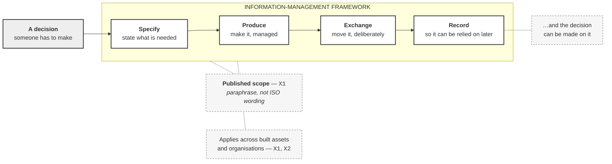

# M03-S01 — ISO 19650 is an information-management framework

| Field | Value |
|---|---|
| **Slide-source identifier** | `M03-S01` |
| **Related slide** | Slide 1 |
| **Slide title** | ISO 19650 is an information-management framework |
| **Related visual concept** | **`V1` — state 1 of 2.** State 2 is `M03-S02` |
| **Teaching purpose** | Establish the subject as **information for decisions** — specified, produced, exchanged, recorded — before any platform expectation fills the gap |
| **Principal sources** | `X1` — published scope of `ISO 19650-1:2018`; `X2` for cross-organisation reach |
| **Evidence classification** | **`PUBLIC-SOURCE`** for the four framework acts and the reach; **`INTERP`** for the decision anchor and the panel framing |
| **Jurisdiction** | **International** |
| **Known limitation** | **The standard has not been read for this programme.** This is *published scope*, paraphrased — not a model, not a process, and not a complete account of anything |
| **Copyright risk** | **LOW** — original construction; no ISO figure, table or structure is involved |
| **Overclaim risk** | **HIGH** — a clean four-part diagram under an ISO-titled slide reads as *the ISO model*. The on-slide source label is the control |
| **Mandatory presentation warning** | **Do not present this as the ISO model.** Say "published scope, my paraphrase" while it is up. **No platform, product or folder appears on this slide** — the platform panel belongs to Slide 2 |
| **Increment** | `T3-F` |

---

## 1. Diagram source — the framework panel

## 2. Reading notes

**The decision comes first, and the loop closes on it.** The four acts are not a
workflow for its own sake — they exist because someone has to decide something.
Starting at *specify* without the decision anchor teaches a process; starting at
the decision teaches the point.

**The four acts are paraphrase.** `X1`'s published scope covers exchanging,
recording, versioning and organising information; *specify* and *produce* come
from the same summary read plainly. **None is a quotation**, and none is a clause.

## 3. Companion panel — what this is not

**A table, not a diagram.** These are five separate corrections, with no
relationship between them to draw.

| It is not | Because |
|---|---|
| A certification of any Autodesk workflow | ISO certifies no vendor workflow, and nothing in `X1`–`X6` supports it |
| Satisfied by using Revit or ACC | Software use is not conformity — Slide 2 |
| A claim that Harrismith complies | `H1` §11.2, §13.4 expressly claim **no** compliance |
| A naming standard | `H1` §11.3: **no ISO filename pattern is imposed** on this project |
| A BIM software manual | The publicly summarised scope is information management, not tools |

**This panel may be delivered as spoken subtraction instead of shown.** If shown,
it is a plain list — no icons, no crosses, no red.

## 4. Simplify and omit

| Simplify | Omit |
|---|---|
| Four acts maximum. If a fifth is tempting, it belongs in the notes | **Any platform, product, folder or permission** — Slide 2's territory |
| One decision anchor, unnamed and generic | Any clause number, section reference or ISO heading |
| One source label, one reach label | Any icon set, any vendor mark, any tick |
| — | Any suggestion that these four acts are exhaustive |

## 5. Overclaim risk

**HIGH, and the failure is silent.** Nobody will say "this is the ISO model" —
the diagram will simply be photographed and reused as one. Two controls: the
**on-slide** source label `Published scope — X1 — paraphrase`, and the presenter
saying once, plainly, that the standard has not been read for this course.

**The second risk is completeness.** Four boxes in a row look like a full account.
They are four acts drawn from a scope summary, and the notes say so.
