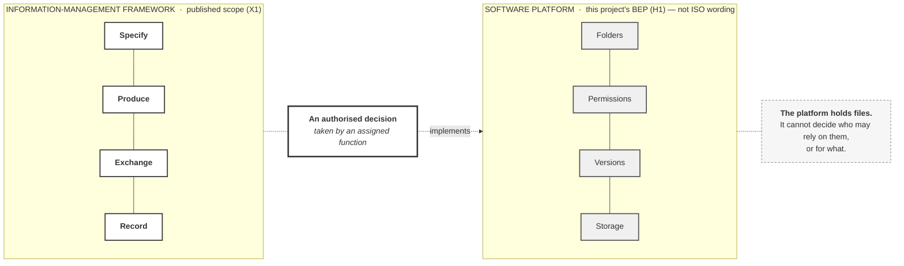

# M03-S02 — It governs information, not a software platform

| Field | Value |
|---|---|
| **Slide-source identifier** | `M03-S02` |
| **Related slide** | Slide 2 |
| **Slide title** | It governs information, not a software platform |
| **Related visual concept** | **`V1` — state 2 of 2.** State 1 is `M03-S01` |
| **Teaching purpose** | Separate the **framework** from the **platform**, and show that configuration follows an authorised decision rather than producing one |
| **Principal sources** | `X1` (framework panel only); `H1` §6.1, §6.8, §6.9, §12.1; `H3` — the folder-names observation |
| **Evidence classification** | **`PUBLIC-SOURCE`** framework panel; **`HARRISMITH`** every platform-panel statement; **`INTERP`** the panel framing |
| **Jurisdiction** | **International** (framework panel) · **This project** (platform panel) |
| **Known limitation** | **Every platform-side statement is this project's BEP wording, not ISO wording.** The standard may phrase these points differently, similarly, or not at all — unverified |
| **Copyright risk** | **LOW** — original construction |
| **Overclaim risk** | **HIGH** — five crisp platform statements delivered under an ISO-titled slide will be heard as the standard's requirements unless attributed |
| **Mandatory presentation warning** | **Attribute the right-hand panel aloud at least once**: *"this is our BEP's wording, not the standard's."* **No product name, logo or screenshot appears.** The panels never touch |
| **Increment** | `T3-F` |

---

## 1. Diagram source — both panels, separated

**The one permitted connector.** `DEC -. "implements" .-> PF` runs **decision →
configuration**, dashed, one way, and **originates from the decision, not from the
framework panel**. Per `H1` §12.1: platform change follows a governance decision,
not the reverse. **There is no return arrow, no equals sign and no bridge.**

## 2. Companion panel — the four distinctions

**A table, not a diagram.** These are four independent statements about one
subject; a flowchart would imply derivation.

| # | Distinction | Harrismith wording |
|---|---|---|
| 1 | A platform **supports** the process | *"an information-management process supported by technology… **it is not a folder tree**"* — §6.1 |
| 2 | **Permission is not authority** | Permissions and platform roles *"support the process; they do not create professional or governance authority"* — §6.9 |
| 3 | **Location is not status** | State, version, revision, status and suitability are five separate properties; a new platform version *"creates none of the others"* — §6.8 |
| 4 | **Configuration is not conformity** | *"Folder names do not themselves prove ISO 19650 governance"* — `H3` |

**All four are `HARRISMITH`.** None is attributed to `X1` or `X2`, and none may be
described as an ISO definition — `source-map.md` `M3-S2-10`.

## 3. Modules 1 and 2 callback — three lines, roughly fifteen seconds

| Module | One line |
|---|---|
| **1** | The BEP is where the method is written down |
| **2** | Someone has to hold each function |
| **3** | This is the framework all of that sits inside |

**Orientation, not revision.** If it grows past three lines, Slide 3 pays for it.

## 4. Simplify and omit

| Simplify | Omit |
|---|---|
| Four items per panel. The framework panel is **the same size as in `M03-S01`** | **Any product name, logo, interface or screenshot** |
| One connector, dashed, labelled `implements` | Any equals sign, bridge, merge or double-headed arrow |
| Two source labels — one per panel | Any tick, score, maturity indicator or completeness marker |
| One take-away note | Any folder tree drawn as though it were the CDE |

## 5. Overclaim risk

**HIGH.** The right-hand panel is the persuasive one — concrete, familiar, and
phrased with the confidence of a standard. Attribute it once, early, and the whole
sequence is safe.

**The design failure to guard against** is shrinking the framework panel when the
platform panel arrives. Keeping it the same size as in `M03-S01` is a content
requirement: the platform is not the substantial thing.
