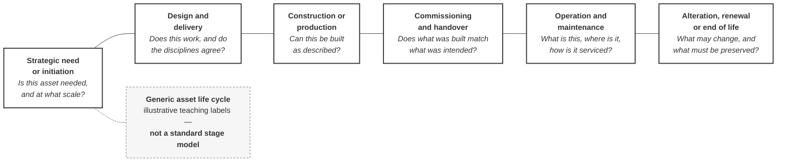

# M03-S04 — Information management runs across the asset life cycle

| Field | Value |
|---|---|
| **Slide-source identifier** | `M03-S04` |
| **Related slide** | Slide 4 |
| **Slide title** | Information management runs across the asset life cycle |
| **Related visual concept** | `V2` |
| **Teaching purpose** | Show that decisions needing information run far beyond delivery — **and that what continues is managed information, not one unchanged model** |
| **Principal sources** | `X1` — life-cycle reach; `H1` §3.3 — the Harrismith scope boundary |
| **Evidence classification** | **`PUBLIC-SOURCE`** for the reach only; **`INTERP`** for every phase label; **`SYNTH`** for the continuity annotation; **`HARRISMITH` — `GAP OR UNVERIFIED`** for the scope bracket |
| **Jurisdiction** | **International** (the reach) · **This project** (the scope bracket) |
| **Known limitation** | **No stage vocabulary is available to this programme.** The six phases are the presenter's neutral teaching labels. `X1` establishes *reach*, not phases |
| **Copyright risk** | **MEDIUM** — stage-model diagrams are frequently protected by their publishers, and widely circulated versions are mostly derivatives. **No ISO life-cycle diagram is reproduced, redrawn or adapted** |
| **Overclaim risk** | **HIGH** — a ribbon with numbered stages reads as *the ISO stages*, and inventing a numbered set is fabrication |
| **Mandatory presentation warning** | **Say "my words, not official phase names" while the ribbon is up, and never number them.** The on-slide label carries it in writing. **Do not describe any operational requirement for Harrismith — none exists** |
| **Increment** | `T3-F` |

---

## 1. Diagram source — the ribbon

**Plain lines, not arrows.** An arrow between phases invites the reading that
*something travels* along it. The ribbon shows **where decisions happen over
time**, not an object in motion.



**No numbering of any kind** — not 1–6, not letters, not Roman numerals. A
numbered band is read as a cited stage system.

## 2. Layout specification — the continuity band and the scope bracket

Mermaid cannot express these two elements honestly. **They are drawn as a
composition beneath the ribbon.**

```text
  ┌────────┬────────┬────────┬────────┬──────────────┬────────┐
  │ need   │ design │ constr │ h'over │  OPERATION   │ end of │   ← ribbon
  │        │        │        │        │  (widest)    │  life  │
  └────────┴────────┴────────┴────────┴──────────────┴────────┘
  ╞═══════════════════════════════════════════════════════════╡
  │  ▪ ▫    ▪ ▪ ▫    ▫ ▪ ▪    ▪ ▫ ▪     ▪ ▫ ▪ ▪      ▫ ▪      │   ← continuity band:
  │  containers appear, supersede, retire — the BAND persists  │     many containers,
  ╞═══════════════════════════════════════════════════════════╡     none travelling
  │◄────── Harrismith's current scope ──────►│                 │
  │  asset management and handover are expressly outside it    │   ← neutral bracket,
  │  (BEP §3.3)                                                │     NOT red
  └────────────────────────────────────────────────────────────┘

  ✗  ONE MODEL ─────────────────────────────────────────────►   ← struck through,
     "the same model carries on through the whole life"            explicitly refused
```

**Three requirements this layout carries.**

1. **The operational band is visibly the widest.** Audiences discount it precisely
   because every diagram they have seen draws it the same width as design.
2. **The continuity band shows many containers appearing, superseding and
   retiring — never one object moving.** What persists is the **band**.
3. **The scope bracket is neutral** — a bracket and a caption. **Not shaded red,
   not marked incomplete.** It is a **deliberately drawn boundary**, and the
   visual must read that way.

## 3. The struck-through annotation

**Named on the visual, not only in speech.** The single-eternal-model reading is
common enough — and consequential enough — to be refused in writing:

> ~~One model carries on through the whole life of the building~~
> **Life-cycle continuity is continuity of *managed information*.**

Prohibition 19; `source-map.md` `M3-S4-10`.

## 4. Harrismith's position — a boundary, not a failure

| | |
|---|---|
| What the project does | Concentrates on **delivery governance** |
| What it does not | `H1` §3.3 places **asset management, handover and standards verification outside current scope** — *"not current requirements and not part of the current baseline scope"* |
| Where handover appears | Only as an **example purpose** — *record / handover information* — in `H1` §6.7 and §10.3, both marked *examples only* |
| Category | **`GAP OR UNVERIFIED`** |

**Say what this is and is not.** A deliberately bounded scope, recorded rather
than left to be discovered. **Not a failure, not non-conformity, and not an
invitation to invent operational requirements for a fire station that has none.**

## 5. Simplify and omit

| Simplify | Omit |
|---|---|
| Six phases, one decision question each | **Any RIBA, ISO, PAS or national stage numbering**, or any named work-stage system |
| One on-slide label, one struck-through annotation, one bracket | **Any single object drawn travelling the ribbon** |
| One continuity band | Any date, duration, scale or programme |
| — | Any red, amber or deficiency treatment on the scope bracket |
| — | Any operational, facilities-management or asset-information requirement for Harrismith |

## 6. Overclaim risk

**HIGH, and it is the phase list.** Six tidy phases on a ribbon read as *the ISO
stages*. There are no stage names available to this programme; the on-slide label
and the spoken caveat are the only controls, and both are required.

**The second risk is the eternal model** — and it is not merely a
misunderstanding. An audience that keeps that belief will later accept a
maintenance obligation nobody can meet.
