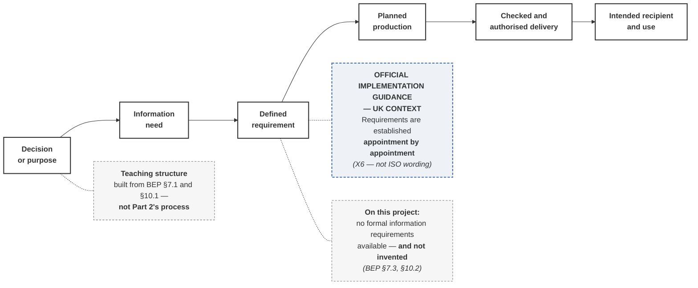

# M03-S05 — Information requirements come before information production

| Field | Value |
|---|---|
| **Slide-source identifier** | `M03-S05` |
| **Related slide** | Slide 5 |
| **Slide title** | Information requirements come before information production |
| **Related visual concept** | `V4` |
| **Teaching purpose** | Show that stating what is needed **precedes** producing it — and that reversing the order produces information nobody can rely on |
| **Principal sources** | `X1` (framing); **`X5`/`X6` — UK guidance**; `H1` §7.1, §7.3, §10.1, §10.2, §2.3 |
| **Evidence classification** | **`INTERP`** for the sequence (`M3-S5-08`); **`GUIDANCE` — UK** for the appointment annotation; **`HARRISMITH`** for the requirement fields; **`HARRISMITH` — `GAP OR UNVERIFIED`** for the absent-requirements note |
| **Jurisdiction** | **International** (framing) · **UNITED KINGDOM** (guidance annotation) · **This project** (requirement fields and gap) — **all three visibly distinguished** |
| **Known limitation** | **The six-step sequence is teaching structure**, built from this project's BEP. **It is not Part 2's process**, which has not been read |
| **Copyright risk** | **MEDIUM** — the requirements hierarchy is among the most reproduced ISO figures in circulation. **It is not reconstructed, and no third-party version is reused** |
| **Overclaim risk** | **HIGH** — a named-document flow chart reads as the standard's information-requirements structure |
| **Mandatory presentation warning** | **The nodes are generic by requirement.** **No client-, exchange-, asset- or project-level requirement acronym appears anywhere** — no definition-level source is registered. **Production never appears before need or requirement** |
| **Increment** | `T3-F` |

---

## 1. Diagram source — the sequence

**The ordering is a content requirement.** *Planned production* never appears
before *information need* or *defined requirement* — not spatially, not in build
order, not by emphasis. **If the eye reaches production first, the visual teaches
the opposite of the slide.**

**The UK-guidance node is visually distinct and carries its jurisdiction label.**
This is the module's first `GUIDANCE` visual, and the convention is set here: a
different weight or tint, an explicit label, and **no merging into the sourced
nodes**.

## 2. Companion panel — what a requirement answers

**A table, not additional nodes.** Seven questions to think with, **not a
template**.

| # | Question | In the sources |
|---|---|---|
| 1 | What **decision or use** does this support? | `H1` §7.3 *purpose*; §10.1 *a purpose* |
| 2 | **Who** needs it? | `H1` §7.3 *intended recipient*; §10.1 *a recipient* |
| 3 | **What** information? | `H1` §7.3 *the container required*; §10.1 *required content* |
| 4 | **When**? | `H1` §7.3 *the milestone or exchange it serves*; §10.1 *timing / event* |
| 5 | What **level of definition or reliability**? | **Not established** — Slide 6 |
| 6 | How will it be **checked**? | `H1` §7.3 *checking requirement*, *authorisation requirement* |
| 7 | What **form or container**? | `H1` §7.3 *required format*; §10.1 *format* |

**Attributed to this project's BEP, not to the standard.** Question 5 is
**unresolved** on Harrismith and is Slide 6's subject.

## 3. The Harrismith gap — shown, not omitted

The requirement node carries a visible note:

> **On this project: no formal information requirements available — and not
> invented.** *(BEP §7.3, §10.2)*

**A flow drawn as fully populated implies requirements this project does not
have.** Supporting context, for the notes rather than the slide: `H1` §2.3
records procurement route, contract type, contractual milestones and final
delivery programme as **not established — TBD**, and training-developed
requirements are labelled **PROPOSED GOVERNANCE or TRAINING ASSUMPTION**.

## 4. Simplify and omit

| Simplify | Omit |
|---|---|
| Six nodes, one line, no branches, no loops | **Any requirement acronym** — no definition-level source is registered (prohibition 16) |
| One UK-guidance annotation, one gap note, one structure label | **Any production node placed before need or requirement** |
| The seven questions as a companion table, in short form | **Any upstream requirements hierarchy above the flow** — the expected shape, the protected figure, and unlabellable honestly |
| — | Any platform screenshot or named software |

## 5. Overclaim risk

**HIGH.** A clean six-step flow under an ISO-titled slide reads as the standard's
process. Two controls: the **`Teaching structure`** label on the slide, and the
generic nodes — no document is named, because naming one would require a
definition nobody here holds.

**The acronym pressure is real.** `H1` §7.3 does name several requirement
documents — **only to record that none was made available**. That is Harrismith
noting an absence, **not this module defining vocabulary**, and no abbreviation
reaches the slide.
