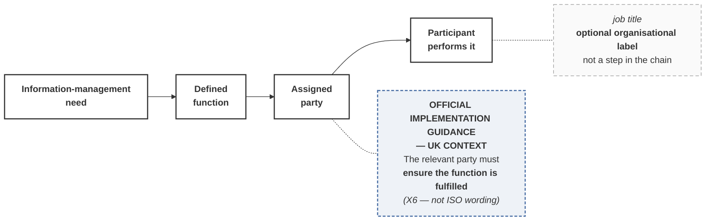

# M03-S07 — Information-management functions are not automatically job titles

| Field | Value |
|---|---|
| **Slide-source identifier** | `M03-S07` |
| **Related slide** | Slide 7 |
| **Slide title** | Information-management functions are not automatically job titles |
| **Related visual concept** | `V13` |
| **Teaching purpose** | Show that a need becomes a **defined function**, which is **assigned to a party**, which a **participant performs** — and that a job title sits **outside** that chain |
| **Principal sources** | **`X6` — UK guidance**; `H1` §4.6, §5.7–§5.9, §5.11 |
| **Evidence classification** | **`GUIDANCE` — UK** for the functions framing and both ensure-fulfilment statements; **`HARRISMITH`** for combination and delegation; **`INTERP`** for the chain |
| **Jurisdiction** | **UNITED KINGDOM** (the guidance basis) · **This project** (the illustration) — **both labelled** |
| **Known limitation** | **No `PUBLIC-SOURCE` statement supports this slide.** Its entire external basis is UK implementation guidance, and **the standard's position on titles has not been read** |
| **Copyright risk** | **LOW** — original construction |
| **Overclaim risk** | **HIGH** — the chain will be read as the standard's assignment process |
| **Mandatory presentation warning** | **Do not say that ISO requires a BIM Manager — or that it requires none.** Both exceed the source (prohibition 21). **No name, organisation or appointment appears; every Harrismith holder is TBD.** No hierarchy, no reporting line, no org-chart shape |
| **Increment** | `T3-F` |

---

## 1. Diagram source — the chain, with the title off-chain

**`job title` is detached, dashed and visibly outside the chain.** It is an
organisational label, not a link in the assignment. **No arrow runs from
*participant* back to *job title*** — that would invite the inference that
performing a function confers, or requires, a title, which is the slide's target.

**No hierarchy of any kind.** No stacked boxes, no reporting lines, no seniority
ordering. `H1` §5.2 disclaims an appointment or organisation chart, and the visual
must not become one.

## 2. Companion panel — five layers held apart

**A table.** Five distinct concepts; a diagram would imply derivation.

| # | Layer | What it is | Required? |
|---|---|---|---|
| 1 | **Required activity** | Something that must happen for information to be relied on | Yes |
| 2 | **Project function** | The defined responsibility for making it happen | Yes |
| 3 | **Appointment** | Who is engaged, and on what terms | Yes |
| 4 | **Job title** | What someone's employer calls them | **Optional** |
| 5 | **Individual participant** | The human performing it on the day | Changes |

**Layers 1–3 must be established for a project to work. Layer 4 is optional and
layer 5 changes.** Most confusion in this area is layer 4 mistaken for layer 2.

## 3. Function combination — shown without merging

**If the visual illustrates one participant carrying two functions, the two
function badges stay visibly separate on the one participant — never fused into a
single combined label** (prohibition 23).

The sourced illustration, from `H1` §5.11:

> Approving a governance change as **BIM Manager** is a different act from
> applying it as **CDE Administrator**, *"even when performed by one person within
> a minute of each other."*

And `H1` §5.8, on Author and Checker: the functional distinction remains —
*"self-checking is still a checking act with a defined requirement, not an
omission of one"* — and **"independence is never claimed where it does not
exist."**

## 4. Harrismith's position — functions defined, holders empty

| Defined function | Named holder |
|---|---|
| BIM Manager · BIM Coordinator · CDE Administration · Lead Delivery Party (`H1` §4.6) | **TBD** |
| Task-Team Lead (§5.7) · Author · Checker (§5.8) | **TBD** |

**Category: `LOCAL ANALOGUE OR INTERPRETATION`.** Harrismith organises itself
around functions rather than titles, which **illustrates** the guidance's framing.
It is **not** evidence that the model is an ISO implementation.

**A deliberate planning state, not an unfinished document** — carried from
Module 2.

## 5. Simplify and omit

| Simplify | Omit |
|---|---|
| Four nodes in one line, one detached label | **Any organisational hierarchy, reporting line or org-chart shape** |
| One UK-guidance annotation, jurisdiction-labelled | **Any name, organisation, appointment or name-shaped placeholder** |
| Five layers as a companion table | **Any assertion that a particular title is required — or that none is** |
| One combination example, badges unfused | Any return arrow from participant to job title |

## 6. Overclaim risk

**HIGH, and the pull is toward liberation.** The guidance genuinely lets a small
team stop arguing about org charts, and that makes it tempting to push one step
further into *"so ISO doesn't require a BIM Manager"*. **That step is not
supported.** Stop at what the guidance says, and say **UK** while saying it.

**The opposite failure** is teaching that titles are worthless. They carry
contractual and organisational weight. The point is narrower and more defensible:
**a title is not evidence the function was assigned.**
