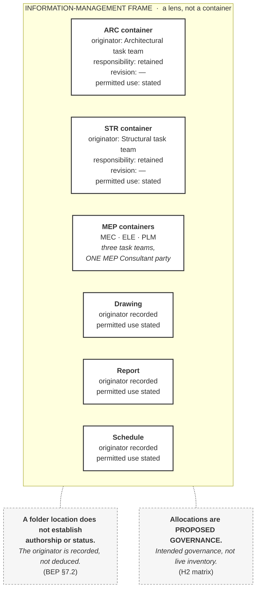

# M03-S09 — Information containers make responsibility manageable

| Field | Value |
|---|---|
| **Slide-source identifier** | `M03-S09` |
| **Related slide** | Slide 9 |
| **Slide title** | Information containers make responsibility manageable |
| **Related visual concept** | `V7` |
| **Teaching purpose** | Show **several separately owned containers** within one information-management frame — and that gathering them together does not merge ownership |
| **Principal sources** | `X1` (framing only); `H1` §6.6, §7.2, §7.9, §8.5, §10.4; **`H2` matrix §3.1** |
| **Evidence classification** | **`PUBLIC-SOURCE`** for the *organising information* framing only; **`HARRISMITH` — analogue** for every sourced statement; **`INTERP`** for the working description and the examples |
| **Jurisdiction** | **This project** (the illustration) · **International** (the framing only) |
| **Known limitation** | **No registered source defines *information container*.** The description is a **working description drawn from `H1`**, labelled as such. The term appears in both vocabularies; **shared vocabulary is not established equivalence** |
| **Copyright risk** | **LOW** — original, Harrismith-sourced |
| **Overclaim risk** | **MEDIUM-HIGH** — a clean diagram of a term used in both vocabularies reads as ISO's definition |
| **Mandatory presentation warning** | **Say *illustrative* aloud** — six examples read as a closed set otherwise. **No state-transition arrow appears; movement is Module 4.** No federated view that merges ownership. No platform screenshot |
| **Increment** | `T3-F` |

---

## 1. Diagram source — separate containers in one frame

**No edges between containers.** They sit *within* a frame; they do not overlap,
nest, fuse or share a boundary. **The frame is a lens, not a container.**

**Three of the six are not models** — drawing, report, schedule. A grid of six
model boxes teaches *container = model*, which is prohibition 27.

**Every container carries a visible originator.** A container without an owner
label is the picture the slide exists to refute.

## 2. The working description — not a definition

> An **information container** is a managed unit of information for which
> responsibility, status, revision and permitted use can be controlled.

***Supported interpretation, drawn from `H1`.*** **No formal ISO definition is
quoted, and none is available to this programme** — `M3-S9-02`, `M3-S9-16`.

**The examples are illustrative, not exhaustive and not normative**: a model, a
drawing, a schedule, a specification, a report, a data file.

## 3. Companion panel — the three sourced statements

**A table.** Three independent statements; no relationship between them to draw.

| Point | Wording | Where |
|---|---|---|
| **Origination** | `party → task team → discipline → information container`. Originator responsibility remains with the producing task team — *"no downstream act relieves it"* | `H1` §7.2 |
| **Folder ≠ authorship** | *"Authorship is not inferred from folder location. Where a container sits tells you where it sits. The originator is recorded, not deduced."* | `H1` §7.2 |
| **Federation** | *"Federation does not merge authorship or responsibility."* Each contributed container *"keeps its originator, its state and its technical responsibility."* Federation is *"a lens"* | `H1` §6.6, §8.5 |

**On consumption**, `H1` §7.9: *"Consumption does not transfer originator
technical responsibility."* The receiver remains responsible for **how it uses**
the information; *"both responsibilities exist at once; neither cancels the
other."*

## 4. If federation is shown at all

**No merged 3D view. No single composite object.** If federation appears, it is a
**translucent outline over separate, still-labelled containers**, annotated:

> *coordination artefact — authorship and responsibility unchanged*

`H1` §8.5: *"nobody becomes responsible for another team's content by appearing
alongside it."*

## 5. Simplify and omit

| Simplify | Omit |
|---|---|
| Six containers maximum, **at least three non-model** | **Any state-transition arrow** — movement is Module 4 |
| Four short labels each: originator · responsibility · revision · permitted use | **Any federated-model image that visually merges ownership** |
| One frame, two annotations | Any platform screenshot, folder tree, product name or file extension |
| The `MEC`/`ELE`/`PLM` bracket — three task teams, one party | The full five-property list — Module 4 |

## 6. Overclaim risk

**MEDIUM-HIGH.** *Information container* appears in **both** vocabularies, so a
tidy diagram reads as ISO's definition. The control is the on-slide label: a
**working description**, drawn from this project's BEP.

**The second risk is completeness.** Six containers in a frame look like an
inventory. The `PROPOSED GOVERNANCE` annotation is required — the matrix describes
**what is intended to be produced, not what exists in the CDE**.

**Boundary.** A brief note that controlled states **exist** is permitted. **How a
container moves between them is Module 4**, and an arrow starts teaching it.
