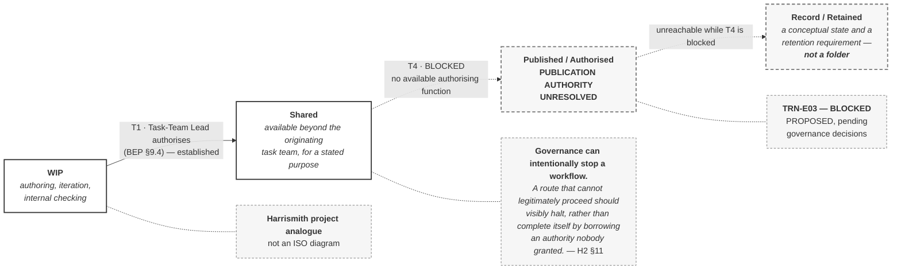

# M03-S10 — The CDE controls permitted use and exchange

| Field | Value |
|---|---|
| **Slide-source identifier** | `M03-S10` |
| **Related slide** | Slide 10 |
| **Slide title** | The CDE controls permitted use and exchange |
| **Related visual concept** | `V8` |
| **Teaching purpose** | Show that a CDE controls **what information may be used for**, that progression happens **by decision** — and that **one route on this project cannot proceed at all** |
| **Principal sources** | `H1` §6.1, §6.3, §6.9, §7.2, §7.5, §9.4, §12.1; **`H2` CDE strategy §1 and §11**; `H2` delivery schedule §5 |
| **Evidence classification** | **`HARRISMITH` — analogue** for the states and principles; **`HARRISMITH` — `GAP OR UNVERIFIED`** for the block and for Record / Retained; **`INTERP`** for the capability list |
| **Jurisdiction** | **This project** |
| **Known limitation** | **No ISO CDE definition and no ISO state model is available to this programme.** These four states are **this project's**, and **conformity has not been demonstrated** |
| **Copyright risk** | **MEDIUM** — state-model diagrams are among the most reproduced. **Original construction from Harrismith terms only**; no ISO figure is involved |
| **Overclaim risk** | **HIGH, on two fronts** — read as the ISO state model, and read as a working system |
| **Mandatory presentation warning** | **The broken arrow must not be "fixed."** A solid route through Published claims a workflow this project cannot operate. **Record / Retained is not a folder, and no `04 Archive` root exists or is approved** |
| **Increment** | `T3-F` |

---

## 1. Diagram source — states, with the block visible

**Why `WIP → Shared` is solid and the rest is not.** The authorising function for
`T1` is **established** — the Task-Team Lead, `H1` §9.4. Drawing every route as
broken would read as *non-functional* rather than *deliberately halted*, which is
a different and wrong lesson.

## 2. The block — required, and it is governance evidence

| | |
|---|---|
| `Shared → Published / Authorised` (**T4**) | **BLOCKED.** Publication / exchange authority is **UNRESOLVED — TBD** (`H1` §9.7; IM matrix D4) |
| Consequence, `H2` §11 | *"Transition **T4** therefore has **no available authorising function**, and information remains **Shared**."* |
| `TRN-E03` | **PROPOSED — BLOCKED PENDING GOVERNANCE DECISIONS.** Recipient not established, formats not established, deliverable set not defined, acceptance authority unresolved |

**The required annotation, in the project's own words** — the best thing on this
slide:

> *"The block is represented deliberately and is a feature of the model, not a gap
> in it: **governance can intentionally stop a workflow**. A route that cannot
> legitimately proceed should visibly halt, rather than complete itself by
> borrowing an authority nobody granted."* — `H2` §11

## 3. Record / Retained is not a folder

`H2` §1 is explicit: a **conceptual state and a retention requirement — *"not
necessarily a folder"***. **No mandatory CDE root named `04 Archive` is required
or approved**, none is created, and the project's retention approach is **TBD**
(`H1` §6.3).

**Drawing it as a folder invents an unapproved requirement.**

## 4. Companion panel — what a CDE controls, and four distinctions

**Tables, not additional nodes.** Adding them to the diagram would imply the
states produce them.

| A CDE supports | |
|---|---|
| Controlled availability | Who can see what, and from when |
| Traceability | What happened to a container, and who did it |
| Version awareness | Which one you are looking at |
| Defined purposes of use | What it may be relied on **for** |
| Managed exchange | Sending as a deliberate act |
| Separation | Information under development kept apart from information others may rely on |

| # | Distinction | Harrismith wording |
|---|---|---|
| 1 | **Platform ≠ CDE governance** | *"a process supported by technology… it is not a folder tree"* — §6.1 |
| 2 | **Folder ≠ status** | §7.2, §6.8 |
| 3 | **Permission ≠ authority** | Permissions *"do not create professional or governance authority"* — §6.9 |
| 4 | **Movement ≠ authorised transition** | Decision precedes configuration — §12.1 |

## 5. Simplify and omit

| Simplify | Omit |
|---|---|
| Four states, exactly as Harrismith names them | **The full transition set `T1`–`T8`**, evidence requirements and conditions |
| Two routes — one working, one blocked | **Any folder representation**, and **any `04 Archive`** |
| One quotation, one project-analogue label, one blocked-event note | Any naming, suitability or metadata coding |
| — | **Any gear, pipeline or conveyor metaphor** suggesting automatic transition |
| — | Any platform screenshot or product name |

## 6. Overclaim risk — and the single most important instruction in this set

**HIGH, on two fronts.** It will be read as the ISO state model — **it is not, and
no ISO state model has been seen**. And a complete-looking diagram implies a
working system.

**Every instinct in visual design will push toward completing that arrow**,
because a broken chain looks like an unfinished drawing.

**It is not unfinished. It is accurate.** A solid route through Published claims a
workflow this project cannot operate, and it is the most misleading thing this
module could put on a screen. **If a producer "fixes" it, the fix is reverted.**

**Boundary.** Two routes, not eight transitions. **If the visual begins showing
how a transition is executed — evidence, conditions, sign-off — it is Module 4's
and must be removed.**
