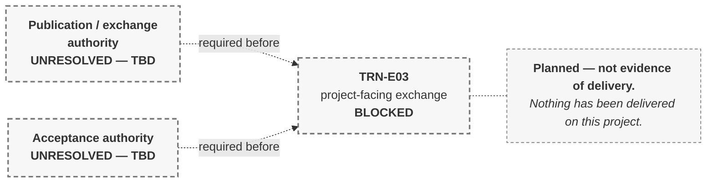

# M03-S11 — Information delivery must be planned

| Field | Value |
|---|---|
| **Slide-source identifier** | `M03-S11` |
| **Related slide** | Slide 11 |
| **Slide title** | Information delivery must be planned |
| **Related visual concept** | `V9` |
| **Teaching purpose** | Show that exchanges are **planned events with stated purposes and recipients** — and that a plan is **not evidence that anything was delivered** |
| **Principal sources** | `X2` (framing only); `H1` §10.1, §10.10, §10.11; **`H2` delivery schedule §5, §5.1, §5.3, §7** |
| **Evidence classification** | **`PUBLIC-SOURCE`** for the framing; **`HARRISMITH` — analogue** for the delivery concepts; **`HARRISMITH` — `GAP OR UNVERIFIED`** for the missing dates, the blocked event and the unestablished recipient; **`INTERP`** for the chain |
| **Jurisdiction** | **International** (framing) · **This project** (content) |
| **Known limitation** | **Nothing has been delivered on this project.** *"Real delivery milestones and dates — **none established.** All timing event-triggered or TBD"* |
| **Copyright risk** | **LOW** — original construction |
| **Overclaim risk** | **HIGH** — a timeline reads as *this happened* |
| **Mandatory presentation warning** | **The label `Planned — not evidence of delivery` appears on the slide.** No tick, no completed item, no progress bar, **no actual date**. The **evidence-status column stays empty for every event** |
| **Increment** | `T3-F` |

---

## 1. Format decision — a table first, a dependency fragment second

**A left-to-right time axis with even spacing implies a programme.** None exists.
The primary form is a **planned-event table** whose empty evidence column carries
the argument; the dependency fragment shows only the blocked route.

## 2. Planned-event table — the primary form

**`Planned — not evidence of delivery`**

| Planned event | Purpose | Planned information | Responsible function | Timing | Recipient / intended use | **Evidence status** |
|---|---|---|---|---|---|---|
| Design coordination share | Coordination input for a defined cycle | Discipline containers, as allocated | **Task-Team Lead** authorises the share | **Event-triggered** | Receiving task teams, for the stated working purpose | *(empty)* |
| Coordination reshare | Correction and resolution update | Revised containers | **Task-Team Lead** | **Event-triggered** | Receiving task teams | *(empty)* |
| **`TRN-E03` — project-facing exchange** | Controlled design review | **TBD — deliverable set not defined** | **UNRESOLVED — no authorising function** | **TBD** | **Not established** | *(empty)* — **BLOCKED** |

**Four requirements this table carries.**

1. **The evidence-status column exists and is empty for every row.** Its
   emptiness is the slide's argument; a visual without it is a plan pretending to
   be a record.
2. **No actual dates.** Timing is **event-triggered** or **TBD** only.
3. **`TRN-E03` is shown blocked**, consistent with `M03-S10`. **A table drawn as
   operable would contradict Slide 10.**
4. **Recipient and acceptance authority stay unpopulated.** *"Assigning a
   plausible authority to make the row look finished would manufacture governance
   that does not exist"* — `H2` §5.1.

## 3. Dependency fragment — the blocked route only

**All dashed.** Nothing here is established, and no solid line may appear.

## 4. Companion panel — four distinct states

**A table.** `H2` §5.3 and `H1` §10.11 keep these apart, and they are collapsed
constantly.

| **Published** | **Delivered** | **Received** | **Accepted** |
|---|---|---|---|
| Authorised for a defined purpose | Sent to an identified recipient | Arrived and registered | Acknowledged as suitable for the stated purpose |

> *"Delivery does not prove acceptance. Receipt does not prove suitability.
> Acceptance applies only to the identified purpose, and does not transfer
> technical responsibility from the originator."* — `H2` §5.3

**The line that carries the slide**, `H1` §10.1:

> **Presence in Published does not establish a delivery.** Information sitting in
> a published location has not been delivered to anyone; **delivery is an act with
> a recipient and a purpose, not a location.**

## 5. Simplify and omit

| Simplify | Omit |
|---|---|
| Two or three planned events maximum | **Every tick, completed marker, progress bar and percentage** |
| One label, one dependency fragment, one four-state panel | **Any actual date** — inventing one creates a project commitment from a teaching slide |
| Timing shown as *event-triggered* or *TBD* | The schedule's field structure, row construction and condition lists |
| — | **Any populated recipient or acceptance authority** |
| — | Any suitability or purpose coding — Module 5 |

## 6. Overclaim risk

**HIGH.** A timeline reads as *this happened*. **Nothing has been delivered**, no
real dates exist, and one event is blocked. The on-slide label and the empty
evidence column are the controls, and both are required.

**Boundary.** Purpose and suitability mechanics, field structures and row
construction are **Module 5**. This visual shows **that** exchanges are planned
and **that** one is blocked — never **how** a row is populated.
