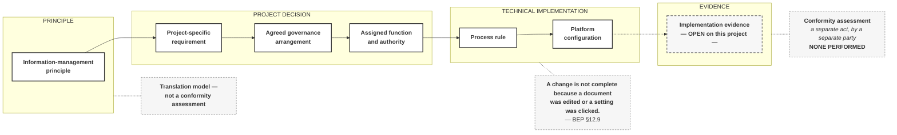

# M03-S12 — A principle is not a platform configuration

| Field | Value |
|---|---|
| **Slide-source identifier** | `M03-S12` |
| **Related slide** | Slide 12 |
| **Slide title** | A principle is not a platform configuration |
| **Related visual concept** | `V10` |
| **Teaching purpose** | Show the path **from principle to evidence** — and show that Harrismith's own path runs out before the end |
| **Principal sources** | `H1` §1.1, §2.4, §4.7, §11.2, §12.1, §12.9, §13.4; **`H2` IM matrix §3.7 (`A1`–`A5`)** |
| **Evidence classification** | **`SYNTH`** for the chain itself; **`HARRISMITH` — analogue** for each step's supporting statement; **`HARRISMITH` — `GAP OR UNVERIFIED`** for the unresolved authorities and missing evidence; **`INTERP`** for the six separated concepts |
| **Jurisdiction** | **This project.** **No guidance source is used** |
| **Known limitation** | **No registered source presents any translation sequence.** The chain is teaching synthesis, and **completing it would not establish conformity** — assessment is a separate act |
| **Copyright risk** | **LOW** — original construction, provided no certification mark appears |
| **Overclaim risk** | **HIGH** — seven steps with a project's position marked against each is **one design decision away from a scorecard** |
| **Mandatory presentation warning** | **The label `Translation model — not a conformity assessment` appears on the slide.** No score, percentage, level, traffic light or tick. **The evidence stage stays open, and conformity assessment sits outside the chain.** Do not re-argue Slide 2 |
| **Increment** | `T3-F` |

---

## 1. Diagram source — the chain, four bands, assessment outside



**Four requirements this diagram carries.**

1. **The four bands are visually distinct** — principle · project decision ·
   technical implementation · evidence — so the audience can see *where a step
   lives*, not merely its order.
2. **The evidence stage is drawn open**, with a dashed inbound arrow. **Not
   crossed out, not red, not marked failed — open.**
3. **Conformity assessment sits outside the chain**, attached by a dashed
   annotation line, **never as an eighth step**. Making it the terminus implies
   the chain leads there — prohibition 38 in diagram form.
4. **The chain runs one way.** If a return arrow appears at all it is **struck
   through** — `H1` §12.1: **decision precedes configuration**, never the reverse.

## 2. Companion panel — Harrismith's position

**A table, and it is not a scorecard.** No score, percentage, level or traffic
light. **Its value is that the last two rows are empty.**

| Step | Harrismith's position |
|---|---|
| Principle | **Stated as informing the approach** — `H1` §11.2, §13.4 |
| Requirement | **No formal information requirements available** |
| Governance | Governance documents and planned controls **exist** |
| Authority | **Several unresolved** — publication, acceptance; IM matrix **`A2` is `TBD` against every function** |
| Process | Defined in the BEP and supporting resources |
| Configuration | Observed, not verified — *"presence is not maturity"*, *"configuration is not correctness"* (§2.4) |
| **Evidence** | **Incomplete or absent** |
| **Conformity assessment** | **None performed** |

**Design note.** If positions are shown on the diagram at all, show **only the
last two** — evidence and assessment. Marking the first five invites the eye to
read completion, and produces a maturity ladder by accident.

## 3. Companion panel — six things kept separate

**Why this is not a conformity model.**

```text
standard or principle
implementation guidance          ← jurisdiction-bound
project governance
platform configuration
evidence of operation
conformity assessment            ← a separate act, by someone else
```

**Completing the chain does not prove conformity.** Assessment is the sixth item
and a different activity. **Nothing in this module assesses anything.**

## 4. Supporting statements

| Point | Wording | Where |
|---|---|---|
| Direction of travel | **Decision precedes configuration** — platform change follows a governance decision, not the reverse | `H1` §12.1 |
| Three concepts held apart | As-found configuration = **evidence**; intended governance = **a controlled decision**; implemented configuration = **the operational result**. *"Implemented configuration is legitimate only when it traces back to an approved decision"* | `H1` §4.7 |
| The evidence step | **"A change is not complete because a document was edited or a setting was clicked."** | `H1` §12.9 |
| The assurance chain | Assess change → **authorise (`A2` — TBD)** → implement → **verify** → retain evidence | `H2` IM matrix §3.7 |

## 5. Simplify and omit

| Simplify | Omit |
|---|---|
| Seven steps, four bands, one horizontal run | **Any green compliance tick, ISO certification badge or vendor logo** |
| One quotation, one on-slide label | **Any completed maturity ladder, score, percentage, level or traffic light** |
| Harrismith's position as a companion table, last two rows empty | Any platform screenshot |
| — | **Any repetition of Slide 2's argument beyond one callback sentence** |

## 6. Overclaim risk

**HIGH.** This slide becomes a maturity model if it is allowed to. Seven steps in
a row with a position marked against each is a scorecard in waiting, and **a
scorecard is a conformity claim whatever the caption says**.

**The last two rows are the point.** If the slide runs short, cut a middle step —
never the end.

**Boundary.** Assurance procedure — how verification is performed, by whom,
against what — is **Module 6**. This visual shows **that** evidence is required and
**that** it is missing here. Never how to produce it.
